# FibreField Technician Database Documentation

## 📊 Database Overview

The FibreField Technician application uses a robust, encrypted SQLite database powered by Room ORM and SQLCipher for secure local storage. The database implements an offline-first architecture with intelligent synchronization capabilities.

### 🏗️ Database Architecture

- **Database Engine**: SQLite with SQLCipher encryption
- **ORM**: Android Room 2.6+
- **Encryption**: AES-256 encryption for all data
- **Version Management**: Automated migrations with Room
- **Size**: Optimized for mobile with <100MB typical usage
- **Performance**: Indexed for <100ms query response times

## 🗂️ Entity Relationship Diagram

```mermaid
erDiagram
    PROJECTS ||--o{ DROPS : contains
    DROPS ||--o{ INSTALLATIONS : has
    INSTALLATIONS ||--o{ PHOTOS : includes
    INSTALLATIONS ||--o{ REMEDIATION_TASKS : may_have
    TECHNICIANS ||--o{ INSTALLATIONS : performs
    TECHNICIANS ||--o{ SESSIONS : has
    INSTALLATIONS ||--o{ ACTIVATION_REPORTS : generates
    PHOTOS ||--o{ VALIDATION_RESULTS : has
    SYNC_QUEUE }o--|| ALL_ENTITIES : tracks
    AI_CONVERSATIONS }o--|| INSTALLATIONS : belongs_to
    
    PROJECTS {
        int project_id PK
        string project_name
        string boundary_polygon
        int total_drops
        int completed_drops
        int active_drops
        int failed_drops
        boolean active
        timestamp created_at
        timestamp updated_at
        string metadata
    }
    
    DROPS {
        string drop_number PK
        int project_id FK
        double latitude
        double longitude
        double altitude
        float accuracy
        string address
        string status
        string customer_name
        string customer_phone
        string customer_email
        string assigned_technician_id FK
        timestamp installation_date
        string activation_status
        timestamp activation_date
        string notes
        int priority
        timestamp created_at
        timestamp updated_at
        string sync_status
        timestamp last_sync_attempt
        string sync_error
    }
    
    INSTALLATIONS {
        long installation_id PK
        string drop_number FK
        string technician_id FK
        timestamp start_time
        timestamp end_time
        string status
        string installation_type
        string ont_serial
        string ont_model
        string router_serial
        string router_model
        float cable_length
        float signal_strength
        float speed_test_download
        float speed_test_upload
        float speed_test_ping
        string customer_signature
        boolean customer_satisfied
        string customer_feedback
        string notes
        string issues_encountered
        string weather_conditions
        timestamp submission_time
        string sync_status
        string server_id
        string metadata
    }
    
    PHOTOS {
        long photo_id PK
        long installation_id FK
        string photo_type
        int sequence_number
        string file_path
        string thumbnail_path
        long file_size
        string mime_type
        timestamp capture_time
        double capture_latitude
        double capture_longitude
        double capture_altitude
        float capture_accuracy
        int device_orientation
        string validation_status
        float validation_confidence
        string validation_issues
        timestamp validation_time
        string ai_detected_objects
        float ai_quality_score
        boolean manual_override
        string override_reason
        string override_by
        timestamp override_time
        string sync_status
        string upload_url
        timestamp upload_time
        int upload_attempts
        string metadata
    }
    
    TECHNICIANS {
        string technician_id PK
        string name
        string email
        string phone
        string role
        string certifications
        string active_projects
        string permissions
        boolean active
        timestamp last_login
        timestamp created_at
        timestamp updated_at
    }
    
    REMEDIATION_TASKS {
        long task_id PK
        long installation_id FK
        string drop_number FK
        string issue_type
        string description
        timestamp created_at
        timestamp resolved_at
        string resolution_notes
        string status
        string assigned_to
        int priority
    }
    
    VALIDATION_RESULTS {
        long validation_id PK
        long photo_id FK
        string validation_type
        string model_version
        float confidence
        string detected_objects
        string issues_found
        string quality_metrics
        timestamp processed_at
        int processing_time_ms
    }
    
    SESSIONS {
        long session_id PK
        string technician_id FK
        timestamp start_time
        timestamp end_time
        string device_info
        string app_version
        string location_data
        string session_metadata
    }
    
    AI_CONVERSATIONS {
        long conversation_id PK
        long installation_id FK
        string user_input
        string assistant_response
        timestamp timestamp
        string context_metadata
        string conversation_type
    }
    
    SYNC_QUEUE {
        long sync_id PK
        string entity_type
        string entity_id
        string operation
        string payload
        timestamp created_at
        int retry_count
        int max_retries
        timestamp last_attempt
        string last_error
        int priority
    }
    
    OFFLINE_MAP_TILES {
        long tile_id PK
        int zoom_level
        int tile_x
        int tile_y
        string tile_data
        timestamp downloaded_at
        timestamp expires_at
    }
    
    CONFIGURATIONS {
        string config_key PK
        string config_value
        string config_type
        timestamp updated_at
    }
```



## 📋 Detailed Table Schemas

### 🏢 Projects Table

Stores project information and boundaries.

```sql
CREATE TABLE projects (
    project_id INTEGER PRIMARY KEY NOT NULL,
    project_name TEXT NOT NULL,
    boundary_polygon TEXT NOT NULL, -- GeoJSON polygon
    total_drops INTEGER NOT NULL DEFAULT 0,
    completed_drops INTEGER NOT NULL DEFAULT 0,
    active_drops INTEGER NOT NULL DEFAULT 0,
    failed_drops INTEGER NOT NULL DEFAULT 0,
    active INTEGER NOT NULL DEFAULT 1,
    created_at INTEGER NOT NULL,
    updated_at INTEGER NOT NULL,
    metadata TEXT -- JSON for extensibility
);

CREATE INDEX idx_projects_active ON projects(active);
```

**Key Features:**
- Stores project boundaries as GeoJSON for spatial queries
- Maintains real-time statistics for dashboard display
- Metadata field allows for future extensions

### 📍 Drops Table

Central table for fiber drop management.

```sql
CREATE TABLE drops (
    drop_number TEXT PRIMARY KEY NOT NULL,
    project_id INTEGER NOT NULL,
    latitude REAL NOT NULL,
    longitude REAL NOT NULL,
    altitude REAL,
    accuracy REAL,
    address TEXT NOT NULL,
    status TEXT NOT NULL DEFAULT 'AVAILABLE', -- AVAILABLE, ASSIGNED, IN_PROGRESS, COMPLETED, FAILED
    customer_name TEXT,
    customer_phone TEXT,
    customer_email TEXT,
    assigned_technician_id TEXT,
    installation_date INTEGER,
    activation_status TEXT NOT NULL DEFAULT 'PENDING', -- PENDING, SCHEDULED, ACTIVE, FAILED
    activation_date INTEGER,
    notes TEXT,
    priority INTEGER NOT NULL DEFAULT 0, -- Higher = more urgent
    created_at INTEGER NOT NULL,
    updated_at INTEGER NOT NULL,
    sync_status TEXT NOT NULL DEFAULT 'PENDING', -- PENDING, IN_PROGRESS, SYNCED, FAILED, CONFLICT
    last_sync_attempt INTEGER,
    sync_error TEXT,
    FOREIGN KEY(project_id) REFERENCES projects(project_id) ON DELETE CASCADE,
    FOREIGN KEY(assigned_technician_id) REFERENCES technicians(technician_id) ON DELETE SET NULL
);

-- Performance indices
CREATE INDEX idx_drops_project ON drops(project_id);
CREATE INDEX idx_drops_status ON drops(status);
CREATE INDEX idx_drops_assigned ON drops(assigned_technician_id);
CREATE INDEX idx_drops_location ON drops(latitude, longitude);
CREATE INDEX idx_drops_sync ON drops(sync_status);
CREATE INDEX idx_drops_project_status ON drops(project_id, status);
```

**Key Features:**
- Composite primary key using drop number for global uniqueness
- Embedded location data with accuracy tracking
- Priority system for work queue management
- Comprehensive sync tracking with error handling

### 🔧 Installations Table

Tracks installation workflow and progress.

```sql
CREATE TABLE installations (
    installation_id INTEGER PRIMARY KEY AUTOINCREMENT NOT NULL,
    drop_number TEXT NOT NULL,
    technician_id TEXT NOT NULL,
    start_time INTEGER NOT NULL,
    end_time INTEGER,
    status TEXT NOT NULL, -- STARTED, IN_PROGRESS, COMPLETED, FAILED, CANCELLED
    installation_type TEXT NOT NULL DEFAULT 'NEW', -- NEW, UPGRADE, REMEDIATION
    -- Equipment Information
    ont_serial TEXT,
    ont_model TEXT,
    router_serial TEXT,
    router_model TEXT,
    -- Technical Measurements
    cable_length REAL,
    signal_strength REAL,
    speed_test_download REAL,
    speed_test_upload REAL,
    speed_test_ping REAL,
    -- Customer Information
    customer_signature TEXT, -- Base64 encoded image
    customer_satisfied INTEGER, -- Boolean: 1=satisfied, 0=unsatisfied
    customer_feedback TEXT,
    -- Installation Details
    notes TEXT,
    issues_encountered TEXT, -- JSON array of issues
    weather_conditions TEXT,
    -- Sync Information
    submission_time INTEGER,
    sync_status TEXT NOT NULL DEFAULT 'PENDING',
    server_id TEXT, -- Server-assigned ID after sync
    metadata TEXT, -- JSON for extensibility
    FOREIGN KEY(drop_number) REFERENCES drops(drop_number) ON DELETE CASCADE,
    FOREIGN KEY(technician_id) REFERENCES technicians(technician_id) ON DELETE SET NULL
);

-- Performance indices
CREATE INDEX idx_installations_drop ON installations(drop_number);
CREATE INDEX idx_installations_technician ON installations(technician_id);
CREATE INDEX idx_installations_status ON installations(status);
CREATE INDEX idx_installations_start_time ON installations(start_time);
CREATE INDEX idx_installations_sync ON installations(sync_status);
CREATE INDEX idx_installations_tech_date ON installations(technician_id, date(start_time, 'unixepoch'));
```

**Key Features:**
- Comprehensive equipment tracking with serial numbers
- Customer satisfaction and feedback collection
- Weather and environmental conditions logging
- Issues tracking for quality analysis

### 📸 Photos Table

Stores installation photos with AI validation results.

```sql
CREATE TABLE photos (
    photo_id INTEGER PRIMARY KEY AUTOINCREMENT NOT NULL,
    installation_id INTEGER NOT NULL,
    photo_type TEXT NOT NULL, -- CABLE_SPAN, HOME_ENTRY, ONT_BARCODE, ONT_ACTIVE, etc.
    sequence_number INTEGER NOT NULL,
    -- File Management
    file_path TEXT NOT NULL,
    thumbnail_path TEXT,
    file_size INTEGER NOT NULL,
    mime_type TEXT NOT NULL DEFAULT 'image/jpeg',
    -- Capture Metadata
    capture_time INTEGER NOT NULL,
    capture_latitude REAL,
    capture_longitude REAL,
    capture_altitude REAL,
    capture_accuracy REAL,
    device_orientation INTEGER,
    -- AI Validation
    validation_status TEXT NOT NULL DEFAULT 'PENDING', -- PENDING, VALIDATING, PASSED, FAILED, MANUALLY_APPROVED
    validation_confidence REAL,
    validation_issues TEXT, -- JSON array of validation issues
    validation_time INTEGER,
    ai_detected_objects TEXT, -- JSON array of detected objects
    ai_quality_score REAL,
    -- Manual Override
    manual_override INTEGER NOT NULL DEFAULT 0,
    override_reason TEXT,
    override_by TEXT,
    override_time INTEGER,
    -- Sync and Upload
    sync_status TEXT NOT NULL DEFAULT 'PENDING',
    upload_url TEXT,
    upload_time INTEGER,
    upload_attempts INTEGER NOT NULL DEFAULT 0,
    metadata TEXT, -- JSON for extensibility
    FOREIGN KEY(installation_id) REFERENCES installations(installation_id) ON DELETE CASCADE
);

-- Performance indices
CREATE INDEX idx_photos_installation ON photos(installation_id);
CREATE INDEX idx_photos_type ON photos(photo_type);
CREATE INDEX idx_photos_validation ON photos(validation_status);
CREATE INDEX idx_photos_sync ON photos(sync_status);
CREATE INDEX idx_photos_install_type ON photos(installation_id, photo_type);
CREATE INDEX idx_photos_sequence ON photos(installation_id, sequence_number);
```

**Key Features:**
- Complete photo lifecycle tracking from capture to upload
- AI validation results with confidence scoring
- Manual override capabilities with audit trail
- Metadata storage for future ML model improvements

### 👷 Technicians Table

Stores technician profiles and capabilities.

```sql
CREATE TABLE technicians (
    technician_id TEXT PRIMARY KEY NOT NULL,
    name TEXT NOT NULL,
    email TEXT,
    phone TEXT,
    role TEXT NOT NULL, -- TECHNICIAN, SENIOR_TECHNICIAN, SUPERVISOR
    certifications TEXT, -- JSON array of certifications
    active_projects TEXT, -- JSON array of project IDs
    permissions TEXT, -- JSON array of permissions
    active INTEGER NOT NULL DEFAULT 1,
    last_login INTEGER,
    created_at INTEGER NOT NULL,
    updated_at INTEGER NOT NULL
);

CREATE INDEX idx_technicians_active ON technicians(active);
CREATE INDEX idx_technicians_role ON technicians(role);
```

### 🔧 Remediation Tasks Table

Tracks issues and remediation work.

```sql
CREATE TABLE remediation_tasks (
    task_id INTEGER PRIMARY KEY AUTOINCREMENT NOT NULL,
    installation_id INTEGER NOT NULL,
    drop_number TEXT NOT NULL,
    issue_type TEXT NOT NULL, -- SIGNAL_ISSUE, EQUIPMENT_FAILURE, CUSTOMER_ISSUE, etc.
    description TEXT,
    created_at INTEGER NOT NULL,
    resolved_at INTEGER,
    resolution_notes TEXT,
    status TEXT NOT NULL DEFAULT 'OPEN', -- OPEN, IN_PROGRESS, RESOLVED, CANCELLED
    assigned_to TEXT,
    priority INTEGER NOT NULL DEFAULT 0,
    FOREIGN KEY(installation_id) REFERENCES installations(installation_id) ON DELETE CASCADE,
    FOREIGN KEY(drop_number) REFERENCES drops(drop_number) ON DELETE CASCADE,
    FOREIGN KEY(assigned_to) REFERENCES technicians(technician_id) ON DELETE SET NULL
);

CREATE INDEX idx_remediation_installation ON remediation_tasks(installation_id);
CREATE INDEX idx_remediation_drop ON remediation_tasks(drop_number);
CREATE INDEX idx_remediation_status ON remediation_tasks(status);
CREATE INDEX idx_remediation_assigned ON remediation_tasks(assigned_to);
```

### 🤖 AI Conversations Table

Stores AI assistant conversation history.

```sql
CREATE TABLE ai_conversations (
    conversation_id INTEGER PRIMARY KEY AUTOINCREMENT NOT NULL,
    installation_id INTEGER,
    user_input TEXT NOT NULL,
    assistant_response TEXT NOT NULL,
    timestamp INTEGER NOT NULL,
    context_metadata TEXT, -- JSON context information
    conversation_type TEXT NOT NULL DEFAULT 'GUIDANCE', -- GUIDANCE, TROUBLESHOOTING, GENERAL
    FOREIGN KEY(installation_id) REFERENCES installations(installation_id) ON DELETE CASCADE
);

CREATE INDEX idx_conversations_installation ON ai_conversations(installation_id);
CREATE INDEX idx_conversations_timestamp ON ai_conversations(timestamp);
CREATE INDEX idx_conversations_type ON ai_conversations(conversation_type);
```

### 🔄 Sync Queue Table

Manages offline data synchronization.

```sql
CREATE TABLE sync_queue (
    sync_id INTEGER PRIMARY KEY AUTOINCREMENT NOT NULL,
    entity_type TEXT NOT NULL, -- DROP, INSTALLATION, PHOTO, REMEDIATION
    entity_id TEXT NOT NULL,
    operation TEXT NOT NULL, -- CREATE, UPDATE, DELETE
    payload TEXT NOT NULL, -- JSON data to sync
    created_at INTEGER NOT NULL,
    retry_count INTEGER NOT NULL DEFAULT 0,
    max_retries INTEGER NOT NULL DEFAULT 3,
    last_attempt INTEGER,
    last_error TEXT,
    priority INTEGER NOT NULL DEFAULT 0, -- Higher = more urgent
    UNIQUE(entity_type, entity_id, operation)
);

CREATE INDEX idx_sync_queue_entity ON sync_queue(entity_type, entity_id);
CREATE INDEX idx_sync_queue_created ON sync_queue(created_at);
CREATE INDEX idx_sync_queue_retry ON sync_queue(retry_count);
CREATE INDEX idx_sync_queue_pending ON sync_queue(retry_count, priority, created_at) 
    WHERE retry_count < max_retries;
```

### 🗺️ Offline Map Tiles Table

Caches map tiles for offline use.

```sql
CREATE TABLE offline_map_tiles (
    tile_id INTEGER PRIMARY KEY AUTOINCREMENT NOT NULL,
    zoom_level INTEGER NOT NULL,
    tile_x INTEGER NOT NULL,
    tile_y INTEGER NOT NULL,
    tile_data BLOB NOT NULL, -- Compressed image data
    downloaded_at INTEGER NOT NULL,
    expires_at INTEGER NOT NULL,
    UNIQUE(zoom_level, tile_x, tile_y)
);

CREATE INDEX idx_tiles_zoom ON offline_map_tiles(zoom_level);
CREATE INDEX idx_tiles_coords ON offline_map_tiles(tile_x, tile_y);
CREATE INDEX idx_tiles_expires ON offline_map_tiles(expires_at);
```

### ⚙️ Configurations Table

Stores app configuration and settings.

```sql
CREATE TABLE configurations (
    config_key TEXT PRIMARY KEY NOT NULL,
    config_value TEXT NOT NULL,
    config_type TEXT NOT NULL, -- STRING, INTEGER, BOOLEAN, JSON
    updated_at INTEGER NOT NULL
);

-- Default configurations
INSERT INTO configurations VALUES 
    ('app_version', '1.0.0', 'STRING', strftime('%s', 'now')),
    ('sync_interval_minutes', '15', 'INTEGER', strftime('%s', 'now')),
    ('offline_maps_enabled', 'true', 'BOOLEAN', strftime('%s', 'now')),
    ('ai_validation_enabled', 'true', 'BOOLEAN', strftime('%s', 'now')),
    ('max_photo_retries', '3', 'INTEGER', strftime('%s', 'now'));
```

## 🔐 Database Security

### Encryption Implementation

```kotlin
// Database encryption with SQLCipher
class SecureDatabaseFactory {
    fun createDatabase(context: Context): FibreFieldDatabase {
        val passphrase = getOrCreatePassphrase(context)
        val factory = SupportFactory(passphrase)
        
        return Room.databaseBuilder(
            context.applicationContext,
            FibreFieldDatabase::class.java,
            "fibrefield_encrypted.db"
        )
        .openHelperFactory(factory)
        .addCallback(DatabaseCallback())
        .build()
    }
    
    private fun getOrCreatePassphrase(context: Context): ByteArray {
        // Generate or retrieve 32-byte key from Android Keystore
        return KeystoreManager.getOrCreateDatabaseKey()
    }
}
```

### Security Features

- **AES-256 Encryption**: All data encrypted at rest
- **Keystore Integration**: Encryption keys stored in Android Keystore
- **SQL Injection Prevention**: Parameterized queries only
- **Access Control**: Database only accessible by app
- **Secure Deletion**: Overwrite deleted data

## 📊 Performance Optimization

### Indexing Strategy

```sql
-- Composite indices for common query patterns
CREATE INDEX idx_drops_project_status_priority ON drops(project_id, status, priority DESC);
CREATE INDEX idx_installations_tech_status_date ON installations(technician_id, status, start_time DESC);
CREATE INDEX idx_photos_install_sequence ON photos(installation_id, sequence_number);

-- Covering indices for sync operations
CREATE INDEX idx_sync_queue_pending_cover ON sync_queue(
    entity_type, 
    priority DESC, 
    created_at
) WHERE retry_count < max_retries;

-- Partial indices for active data
CREATE INDEX idx_drops_active_assigned ON drops(assigned_technician_id, priority DESC) 
    WHERE status IN ('ASSIGNED', 'IN_PROGRESS');
```

### Query Optimization Examples

```sql
-- Optimized technician dashboard query
SELECT 
    d.drop_number,
    d.address,
    d.customer_name,
    d.priority,
    i.status as installation_status,
    COUNT(p.photo_id) as photos_taken
FROM drops d
LEFT JOIN installations i ON d.drop_number = i.drop_number
LEFT JOIN photos p ON i.installation_id = p.installation_id
WHERE d.assigned_technician_id = ? 
    AND d.status IN ('ASSIGNED', 'IN_PROGRESS')
GROUP BY d.drop_number, i.installation_id
ORDER BY d.priority DESC, d.created_at ASC
LIMIT 10;

-- Optimized sync queue query
SELECT sync_id, entity_type, entity_id, operation, payload
FROM sync_queue 
WHERE retry_count < max_retries 
ORDER BY priority DESC, created_at ASC 
LIMIT 100;
```

### Database Maintenance

```kotlin
class DatabaseMaintenance @Inject constructor(
    private val database: FibreFieldDatabase
) {
    suspend fun performMaintenance() {
        database.runInTransaction {
            // Update statistics
            database.query("ANALYZE", null)
            
            // Vacuum database
            database.query("VACUUM", null)
            
            // Clean old sync queue entries
            cleanOldSyncEntries()
            
            // Remove expired map tiles
            cleanExpiredMapTiles()
        }
    }
    
    private suspend fun cleanOldSyncEntries() {
        val cutoffDate = System.currentTimeMillis() - TimeUnit.DAYS.toMillis(7)
        database.query(
            "DELETE FROM sync_queue WHERE created_at < ? AND retry_count >= max_retries",
            arrayOf(cutoffDate)
        )
    }
}
```

## 🔄 Database Migrations

### Migration Strategy

```kotlin
// Migration from version 1 to 2
val MIGRATION_1_2 = object : Migration(1, 2) {
    override fun migrate(database: SupportSQLiteDatabase) {
        // Add customer phone field
        database.execSQL(
            "ALTER TABLE drops ADD COLUMN customer_phone TEXT"
        )
        
        // Add index for performance
        database.execSQL(
            "CREATE INDEX idx_drops_customer_phone ON drops(customer_phone)"
        )
    }
}

// Migration from version 2 to 3
val MIGRATION_2_3 = object : Migration(2, 3) {
    override fun migrate(database: SupportSQLiteDatabase) {
        // Create AI conversations table
        database.execSQL("""
            CREATE TABLE ai_conversations (
                conversation_id INTEGER PRIMARY KEY AUTOINCREMENT NOT NULL,
                installation_id INTEGER,
                user_input TEXT NOT NULL,
                assistant_response TEXT NOT NULL,
                timestamp INTEGER NOT NULL,
                context_metadata TEXT,
                FOREIGN KEY(installation_id) REFERENCES installations(installation_id) 
                ON DELETE CASCADE
            )
        """)
        
        database.execSQL(
            "CREATE INDEX idx_conversations_installation ON ai_conversations(installation_id)"
        )
    }
}
```

### Auto-Migration (Room 2.4+)

```kotlin
@Database(
    entities = [/* all entities */],
    version = 4,
    autoMigrations = [
        AutoMigration(from = 3, to = 4, spec = Migration3To4Spec::class)
    ]
)
@RenameColumn(
    tableName = "drops",
    fromColumnName = "notes",
    toColumnName = "technician_notes"
)
class Migration3To4Spec : AutoMigrationSpec
```

## 📈 Database Analytics

### Key Metrics Tracked

```sql
-- Installation success rate by technician
SELECT 
    technician_id,
    COUNT(*) as total_installations,
    SUM(CASE WHEN status = 'COMPLETED' THEN 1 ELSE 0 END) as completed,
    ROUND(
        (SUM(CASE WHEN status = 'COMPLETED' THEN 1 ELSE 0 END) * 100.0 / COUNT(*)), 2
    ) as success_rate
FROM installations
WHERE start_time >= ?
GROUP BY technician_id
ORDER BY success_rate DESC;

-- Photo validation statistics
SELECT 
    photo_type,
    COUNT(*) as total_photos,
    SUM(CASE WHEN validation_status = 'PASSED' THEN 1 ELSE 0 END) as passed,
    SUM(CASE WHEN manual_override = 1 THEN 1 ELSE 0 END) as overridden,
    AVG(validation_confidence) as avg_confidence
FROM photos
WHERE capture_time >= ?
GROUP BY photo_type;

-- Sync queue health
SELECT 
    entity_type,
    COUNT(*) as pending_items,
    AVG(retry_count) as avg_retries,
    MAX(created_at) as last_created
FROM sync_queue
WHERE retry_count < max_retries
GROUP BY entity_type;
```

## 🔧 Database Administration

### Backup and Recovery

```kotlin
class DatabaseBackupManager @Inject constructor(
    private val context: Context,
    private val database: FibreFieldDatabase
) {
    suspend fun createBackup(): File {
        val backupDir = File(context.filesDir, "backups")
        backupDir.mkdirs()
        
        val timestamp = SimpleDateFormat("yyyyMMdd_HHmmss", Locale.US).format(Date())
        val backupFile = File(backupDir, "backup_$timestamp.db")
        
        // Close database connections
        database.close()
        
        // Copy database file
        val originalDb = context.getDatabasePath("fibrefield_encrypted.db")
        originalDb.copyTo(backupFile)
        
        return backupFile
    }
    
    suspend fun restoreFromBackup(backupFile: File) {
        database.close()
        
        val currentDb = context.getDatabasePath("fibrefield_encrypted.db")
        backupFile.copyTo(currentDb, overwrite = true)
        
        // Reinitialize database
        DatabaseProvider.reinitialize(context)
    }
}
```

### Database Health Monitoring

```kotlin
class DatabaseHealthMonitor @Inject constructor(
    private val database: FibreFieldDatabase
) {
    suspend fun getHealthReport(): DatabaseHealthReport {
        val dbSize = getDatabaseSize()
        val tableStats = getTableStatistics()
        val indexEfficiency = checkIndexEfficiency()
        val syncQueueHealth = getSyncQueueHealth()
        
        return DatabaseHealthReport(
            databaseSize = dbSize,
            tableStatistics = tableStats,
            indexEfficiency = indexEfficiency,
            syncQueueHealth = syncQueueHealth,
            lastVacuum = getLastVacuumTime(),
            lastAnalyze = getLastAnalyzeTime()
        )
    }
    
    private suspend fun getSyncQueueHealth(): SyncQueueHealth {
        val pending = database.syncQueueDao().getPendingCount()
        val failed = database.syncQueueDao().getFailedCount()
        val oldestPending = database.syncQueueDao().getOldestPending()
        
        return SyncQueueHealth(
            pendingItems = pending,
            failedItems = failed,
            oldestPendingAge = oldestPending?.let { 
                System.currentTimeMillis() - it 
            }
        )
    }
}
```

## 🧪 Testing Database Layer

### Unit Testing DAOs

```kotlin
@RunWith(AndroidJUnit4::class)
class DropDaoTest {
    
    @get:Rule
    val instantTaskExecutorRule = InstantTaskExecutorRule()
    
    private lateinit var database: FibreFieldDatabase
    private lateinit var dropDao: DropDao
    
    @Before
    fun setup() {
        val context = ApplicationProvider.getApplicationContext<Context>()
        database = Room.inMemoryDatabaseBuilder(
            context, FibreFieldDatabase::class.java
        ).build()
        dropDao = database.dropDao()
    }
    
    @After
    fun teardown() {
        database.close()
    }
    
    @Test
    fun insertAndRetrieveDrop() = runTest {
        // Given
        val drop = createTestDrop()
        
        // When
        dropDao.insert(drop)
        val retrieved = dropDao.getDropByNumber(drop.dropNumber)
        
        // Then
        assertThat(retrieved).isNotNull()
        assertThat(retrieved?.dropNumber).isEqualTo(drop.dropNumber)
        assertThat(retrieved?.address).isEqualTo(drop.address)
    }
    
    @Test
    fun getDropsByProjectAndStatus() = runTest {
        // Given
        val project1Drops = (1..5).map { createTestDrop("PROJ1-$it", 1) }
        val project2Drops = (1..3).map { createTestDrop("PROJ2-$it", 2) }
        
        dropDao.insertAll(project1Drops + project2Drops)
        
        // When
        val project1Available = dropDao.getDropsByProjectAndStatus(
            1, DropStatus.AVAILABLE
        ).first()
        
        // Then
        assertThat(project1Available).hasSize(5)
        assertThat(project1Available.map { it.dropNumber })
            .containsExactlyElementsIn(project1Drops.map { it.dropNumber })
    }
}
```

### Integration Testing

```kotlin
@HiltAndroidTest
@LargeTest
class DatabaseIntegrationTest {
    
    @get:Rule
    val hiltRule = HiltAndroidRule(this)
    
    @Inject
    lateinit var database: FibreFieldDatabase
    
    @Before
    fun setup() {
        hiltRule.inject()
    }
    
    @Test
    fun completeInstallationWorkflow() = runTest {
        // Create project and drop
        val project = createTestProject()
        val drop = createTestDrop(projectId = project.projectId)
        
        database.projectDao().insert(project)
        database.dropDao().insert(drop)
        
        // Start installation
        val installation = createTestInstallation(drop.dropNumber)
        val installationId = database.installationDao().insert(installation)
        
        // Add photos
        val photos = (1..9).map { createTestPhoto(installationId, it) }
        photos.forEach { database.photoDao().insert(it) }
        
        // Complete installation
        database.installationDao().completeInstallation(
            installationId = installationId,
            endTime = Date(),
            notes = "Installation completed successfully",
            customerSignature = "signature_data"
        )
        
        // Verify workflow
        val completedInstallation = database.installationDao()
            .getInstallationWithPhotos(installationId)
        
        assertThat(completedInstallation).isNotNull()
        assertThat(completedInstallation?.installation?.status)
            .isEqualTo(InstallationStatus.COMPLETED)
        assertThat(completedInstallation?.photos).hasSize(9)
    }
}
```

## 📚 Common Query Patterns

### Dashboard Queries

```kotlin
// Get technician's active work
@Query("""
    SELECT d.*, i.status as installation_status, 
           COUNT(p.photo_id) as photos_taken
    FROM drops d
    LEFT JOIN installations i ON d.drop_number = i.drop_number
    LEFT JOIN photos p ON i.installation_id = p.installation_id
    WHERE d.assigned_technician_id = :technicianId 
        AND d.status IN ('ASSIGNED', 'IN_PROGRESS')
    GROUP BY d.drop_number
    ORDER BY d.priority DESC, d.created_at ASC
""")
suspend fun getTechnicianActiveWork(technicianId: String): List<TechnicianWorkItem>
```

### Analytics Queries

```kotlin
// Performance metrics
@Query("""
    SELECT 
        technician_id,
        COUNT(*) as total_installations,
        AVG(CAST((julianday(end_time, 'unixepoch') - julianday(start_time, 'unixepoch')) * 24 * 60 AS REAL)) as avg_duration_minutes,
        AVG(speed_test_download) as avg_download_speed,
        SUM(CASE WHEN status = 'COMPLETED' THEN 1 ELSE 0 END) as completed_count
    FROM installations 
    WHERE start_time >= :fromDate 
        AND end_time IS NOT NULL
    GROUP BY technician_id
""")
suspend fun getTechnicianPerformanceMetrics(fromDate: Date): List<PerformanceMetric>
```

### Sync Queries

```kotlin
// Optimized sync queue processing
@Query("""
    SELECT * FROM sync_queue 
    WHERE retry_count < max_retries 
        AND (last_attempt IS NULL 
             OR last_attempt < :retryThreshold)
    ORDER BY priority DESC, created_at ASC 
    LIMIT :limit
""")
suspend fun getItemsForSync(
    retryThreshold: Date,
    limit: Int = 100
): List<SyncQueueEntity>
```

---

## 📞 Support

For database-related questions:
- **Architecture Questions**: dev-team@fibreflow.com  
- **Performance Issues**: performance@fibreflow.com
- **Migration Help**: migrations@fibreflow.com

---

**Database Version**: 1.0  
**Last Updated**: March 2024  
**Schema Review**: June 2024