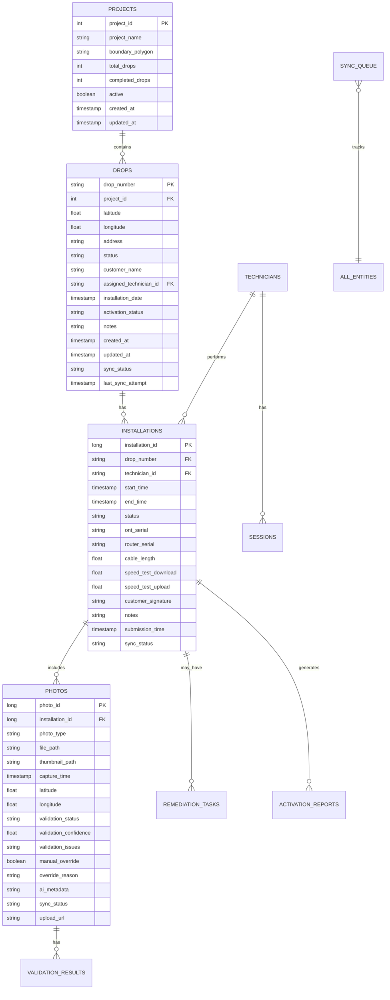

# FibreField Technician BOT - Data Layer Architecture

## 1. Database Schema Design

### 1.1 Complete Entity Relationship Diagram



### 1.2 Room Database Implementation

```kotlin
// Database Configuration
@Database(
    entities = [
        ProjectEntity::class,
        DropEntity::class,
        InstallationEntity::class,
        PhotoEntity::class,
        TechnicianEntity::class,
        RemediationTaskEntity::class,
        ActivationReportEntity::class,
        ValidationResultEntity::class,
        SessionEntity::class,
        SyncQueueEntity::class,
        AIConversationEntity::class,
        OfflineMapTileEntity::class,
        ConfigurationEntity::class
    ],
    version = 1,
    exportSchema = true,
    autoMigrations = []
)
@TypeConverters(
    DateConverter::class,
    LocationConverter::class,
    StatusConverter::class,
    JsonConverter::class,
    ListConverter::class
)
abstract class FibreFieldDatabase : RoomDatabase() {
    
    // DAOs
    abstract fun projectDao(): ProjectDao
    abstract fun dropDao(): DropDao
    abstract fun installationDao(): InstallationDao
    abstract fun photoDao(): PhotoDao
    abstract fun technicianDao(): TechnicianDao
    abstract fun remediationDao(): RemediationDao
    abstract fun activationDao(): ActivationDao
    abstract fun validationDao(): ValidationDao
    abstract fun sessionDao(): SessionDao
    abstract fun syncQueueDao(): SyncQueueDao
    abstract fun conversationDao(): ConversationDao
    abstract fun mapTileDao(): MapTileDao
    abstract fun configDao(): ConfigurationDao
    
    companion object {
        @Volatile
        private var INSTANCE: FibreFieldDatabase? = null
        
        fun getInstance(context: Context): FibreFieldDatabase {
            return INSTANCE ?: synchronized(this) {
                INSTANCE ?: buildDatabase(context).also { INSTANCE = it }
            }
        }
        
        private fun buildDatabase(context: Context): FibreFieldDatabase {
            // Use SQLCipher for encryption
            val passphrase = getOrCreatePassphrase(context)
            val factory = SupportFactory(passphrase)
            
            return Room.databaseBuilder(
                context.applicationContext,
                FibreFieldDatabase::class.java,
                "fibrefield.db"
            )
            .openHelperFactory(factory)
            .addCallback(DatabaseCallback())
            .addMigrations(*getAllMigrations())
            .fallbackToDestructiveMigrationOnDowngrade()
            .setQueryCallback({ sqlQuery, bindArgs ->
                // Log queries in debug mode
                if (BuildConfig.DEBUG) {
                    Log.d("RoomQuery", "Query: $sqlQuery Args: $bindArgs")
                }
            }, Executors.newSingleThreadExecutor())
            .build()
        }
        
        private fun getOrCreatePassphrase(context: Context): ByteArray {
            val secureStorage = SecureStorageImpl(context)
            return runBlocking {
                secureStorage.getDatabasePassphrase() 
                    ?: secureStorage.generateAndSaveDatabasePassphrase()
            }
        }
    }
    
    class DatabaseCallback : RoomDatabase.Callback() {
        override fun onCreate(db: SupportSQLiteDatabase) {
            super.onCreate(db)
            // Create indexes for better performance
            db.execSQL("CREATE INDEX IF NOT EXISTS idx_drops_project ON drops(project_id)")
            db.execSQL("CREATE INDEX IF NOT EXISTS idx_drops_status ON drops(status)")
            db.execSQL("CREATE INDEX IF NOT EXISTS idx_installations_drop ON installations(drop_number)")
            db.execSQL("CREATE INDEX IF NOT EXISTS idx_installations_technician ON installations(technician_id)")
            db.execSQL("CREATE INDEX IF NOT EXISTS idx_photos_installation ON photos(installation_id)")
            db.execSQL("CREATE INDEX IF NOT EXISTS idx_sync_queue_entity ON sync_queue(entity_type, entity_id)")
        }
    }
}
```

## 2. Entity Definitions

### 2.1 Core Entities

```kotlin
// Project Entity
@Entity(
    tableName = "projects",
    indices = [Index(value = ["active"])]
)
data class ProjectEntity(
    @PrimaryKey
    @ColumnInfo(name = "project_id")
    val projectId: Int,
    
    @ColumnInfo(name = "project_name")
    val projectName: String,
    
    @ColumnInfo(name = "boundary_polygon")
    val boundaryPolygon: String, // GeoJSON string
    
    @ColumnInfo(name = "total_drops")
    val totalDrops: Int,
    
    @ColumnInfo(name = "completed_drops")
    val completedDrops: Int = 0,
    
    @ColumnInfo(name = "active_drops")
    val activeDrops: Int = 0,
    
    @ColumnInfo(name = "failed_drops")
    val failedDrops: Int = 0,
    
    @ColumnInfo(name = "active")
    val active: Boolean = true,
    
    @ColumnInfo(name = "created_at")
    val createdAt: Date = Date(),
    
    @ColumnInfo(name = "updated_at")
    val updatedAt: Date = Date(),
    
    @ColumnInfo(name = "metadata")
    val metadata: String? = null // JSON for extensibility
)

// Drop Entity with full relationships
@Entity(
    tableName = "drops",
    foreignKeys = [
        ForeignKey(
            entity = ProjectEntity::class,
            parentColumns = ["project_id"],
            childColumns = ["project_id"],
            onDelete = ForeignKey.CASCADE
        )
    ],
    indices = [
        Index(value = ["project_id"]),
        Index(value = ["status"]),
        Index(value = ["assigned_technician_id"]),
        Index(value = ["sync_status"])
    ]
)
data class DropEntity(
    @PrimaryKey
    @ColumnInfo(name = "drop_number")
    val dropNumber: String,
    
    @ColumnInfo(name = "project_id")
    val projectId: Int,
    
    @Embedded
    val location: LocationData,
    
    @ColumnInfo(name = "address")
    val address: String,
    
    @ColumnInfo(name = "status")
    val status: DropStatus,
    
    @ColumnInfo(name = "customer_name")
    val customerName: String? = null,
    
    @ColumnInfo(name = "customer_phone")
    val customerPhone: String? = null,
    
    @ColumnInfo(name = "customer_email")
    val customerEmail: String? = null,
    
    @ColumnInfo(name = "assigned_technician_id")
    val assignedTechnicianId: String? = null,
    
    @ColumnInfo(name = "installation_date")
    val installationDate: Date? = null,
    
    @ColumnInfo(name = "activation_status")
    val activationStatus: ActivationStatus = ActivationStatus.PENDING,
    
    @ColumnInfo(name = "activation_date")
    val activationDate: Date? = null,
    
    @ColumnInfo(name = "notes")
    val notes: String? = null,
    
    @ColumnInfo(name = "priority")
    val priority: Int = 0,
    
    @ColumnInfo(name = "created_at")
    val createdAt: Date = Date(),
    
    @ColumnInfo(name = "updated_at")
    val updatedAt: Date = Date(),
    
    @ColumnInfo(name = "sync_status")
    val syncStatus: SyncStatus = SyncStatus.PENDING,
    
    @ColumnInfo(name = "last_sync_attempt")
    val lastSyncAttempt: Date? = null,
    
    @ColumnInfo(name = "sync_error")
    val syncError: String? = null
)

// Location embedded object
data class LocationData(
    @ColumnInfo(name = "latitude")
    val latitude: Double,
    
    @ColumnInfo(name = "longitude")
    val longitude: Double,
    
    @ColumnInfo(name = "altitude")
    val altitude: Double? = null,
    
    @ColumnInfo(name = "accuracy")
    val accuracy: Float? = null
)
```

### 2.2 Installation and Photo Entities

```kotlin
// Installation Entity with comprehensive tracking
@Entity(
    tableName = "installations",
    foreignKeys = [
        ForeignKey(
            entity = DropEntity::class,
            parentColumns = ["drop_number"],
            childColumns = ["drop_number"],
            onDelete = ForeignKey.CASCADE
        ),
        ForeignKey(
            entity = TechnicianEntity::class,
            parentColumns = ["technician_id"],
            childColumns = ["technician_id"],
            onDelete = ForeignKey.SET_NULL
        )
    ],
    indices = [
        Index(value = ["drop_number"]),
        Index(value = ["technician_id"]),
        Index(value = ["status"]),
        Index(value = ["start_time"]),
        Index(value = ["sync_status"])
    ]
)
data class InstallationEntity(
    @PrimaryKey(autoGenerate = true)
    @ColumnInfo(name = "installation_id")
    val installationId: Long = 0,
    
    @ColumnInfo(name = "drop_number")
    val dropNumber: String,
    
    @ColumnInfo(name = "technician_id")
    val technicianId: String,
    
    @ColumnInfo(name = "start_time")
    val startTime: Date,
    
    @ColumnInfo(name = "end_time")
    val endTime: Date? = null,
    
    @ColumnInfo(name = "status")
    val status: InstallationStatus,
    
    @ColumnInfo(name = "installation_type")
    val installationType: InstallationType = InstallationType.NEW,
    
    // Equipment details
    @ColumnInfo(name = "ont_serial")
    val ontSerial: String? = null,
    
    @ColumnInfo(name = "ont_model")
    val ontModel: String? = null,
    
    @ColumnInfo(name = "router_serial")
    val routerSerial: String? = null,
    
    @ColumnInfo(name = "router_model")
    val routerModel: String? = null,
    
    // Installation metrics
    @ColumnInfo(name = "cable_length")
    val cableLength: Float? = null,
    
    @ColumnInfo(name = "signal_strength")
    val signalStrength: Float? = null,
    
    @ColumnInfo(name = "speed_test_download")
    val speedTestDownload: Float? = null,
    
    @ColumnInfo(name = "speed_test_upload")
    val speedTestUpload: Float? = null,
    
    @ColumnInfo(name = "speed_test_ping")
    val speedTestPing: Float? = null,
    
    // Customer interaction
    @ColumnInfo(name = "customer_signature")
    val customerSignature: String? = null, // Base64 encoded image
    
    @ColumnInfo(name = "customer_satisfied")
    val customerSatisfied: Boolean? = null,
    
    @ColumnInfo(name = "customer_feedback")
    val customerFeedback: String? = null,
    
    // Additional data
    @ColumnInfo(name = "notes")
    val notes: String? = null,
    
    @ColumnInfo(name = "issues_encountered")
    val issuesEncountered: String? = null, // JSON array
    
    @ColumnInfo(name = "weather_conditions")
    val weatherConditions: String? = null,
    
    // Submission and sync
    @ColumnInfo(name = "submission_time")
    val submissionTime: Date? = null,
    
    @ColumnInfo(name = "sync_status")
    val syncStatus: SyncStatus = SyncStatus.PENDING,
    
    @ColumnInfo(name = "server_id")
    val serverId: String? = null,
    
    @ColumnInfo(name = "metadata")
    val metadata: String? = null // JSON for extensibility
)

// Photo Entity with AI validation tracking
@Entity(
    tableName = "photos",
    foreignKeys = [
        ForeignKey(
            entity = InstallationEntity::class,
            parentColumns = ["installation_id"],
            childColumns = ["installation_id"],
            onDelete = ForeignKey.CASCADE
        )
    ],
    indices = [
        Index(value = ["installation_id"]),
        Index(value = ["photo_type"]),
        Index(value = ["validation_status"]),
        Index(value = ["sync_status"])
    ]
)
data class PhotoEntity(
    @PrimaryKey(autoGenerate = true)
    @ColumnInfo(name = "photo_id")
    val photoId: Long = 0,
    
    @ColumnInfo(name = "installation_id")
    val installationId: Long,
    
    @ColumnInfo(name = "photo_type")
    val photoType: PhotoType,
    
    @ColumnInfo(name = "sequence_number")
    val sequenceNumber: Int,
    
    // File management
    @ColumnInfo(name = "file_path")
    val filePath: String,
    
    @ColumnInfo(name = "thumbnail_path")
    val thumbnailPath: String? = null,
    
    @ColumnInfo(name = "file_size")
    val fileSize: Long,
    
    @ColumnInfo(name = "mime_type")
    val mimeType: String = "image/jpeg",
    
    // Capture metadata
    @ColumnInfo(name = "capture_time")
    val captureTime: Date,
    
    @Embedded(prefix = "capture_")
    val captureLocation: LocationData? = null,
    
    @ColumnInfo(name = "device_orientation")
    val deviceOrientation: Int? = null,
    
    // AI Validation
    @ColumnInfo(name = "validation_status")
    val validationStatus: ValidationStatus = ValidationStatus.PENDING,
    
    @ColumnInfo(name = "validation_confidence")
    val validationConfidence: Float? = null,
    
    @ColumnInfo(name = "validation_issues")
    val validationIssues: String? = null, // JSON array of issues
    
    @ColumnInfo(name = "validation_time")
    val validationTime: Date? = null,
    
    @ColumnInfo(name = "ai_detected_objects")
    val aiDetectedObjects: String? = null, // JSON array
    
    @ColumnInfo(name = "ai_quality_score")
    val aiQualityScore: Float? = null,
    
    // Manual override
    @ColumnInfo(name = "manual_override")
    val manualOverride: Boolean = false,
    
    @ColumnInfo(name = "override_reason")
    val overrideReason: String? = null,
    
    @ColumnInfo(name = "override_by")
    val overrideBy: String? = null,
    
    @ColumnInfo(name = "override_time")
    val overrideTime: Date? = null,
    
    // Sync and upload
    @ColumnInfo(name = "sync_status")
    val syncStatus: SyncStatus = SyncStatus.PENDING,
    
    @ColumnInfo(name = "upload_url")
    val uploadUrl: String? = null,
    
    @ColumnInfo(name = "upload_time")
    val uploadTime: Date? = null,
    
    @ColumnInfo(name = "upload_attempts")
    val uploadAttempts: Int = 0,
    
    @ColumnInfo(name = "metadata")
    val metadata: String? = null // JSON for extensibility
)
```

## 3. Data Access Objects (DAOs)

### 3.1 Drop DAO with Complex Queries

```kotlin
@Dao
interface DropDao {
    
    // Basic CRUD operations
    @Insert(onConflict = OnConflictStrategy.REPLACE)
    suspend fun insert(drop: DropEntity): Long
    
    @Insert(onConflict = OnConflictStrategy.REPLACE)
    suspend fun insertAll(drops: List<DropEntity>)
    
    @Update
    suspend fun update(drop: DropEntity)
    
    @Delete
    suspend fun delete(drop: DropEntity)
    
    // Query operations
    @Query("SELECT * FROM drops WHERE drop_number = :dropNumber")
    suspend fun getDropByNumber(dropNumber: String): DropEntity?
    
    @Query("SELECT * FROM drops WHERE drop_number = :dropNumber")
    fun observeDropByNumber(dropNumber: String): Flow<DropEntity?>
    
    @Query("""
        SELECT * FROM drops 
        WHERE project_id = :projectId 
        AND status = :status 
        ORDER BY priority DESC, created_at ASC
    """)
    fun getDropsByProjectAndStatus(
        projectId: Int,
        status: DropStatus
    ): Flow<List<DropEntity>>
    
    @Query("""
        SELECT * FROM drops 
        WHERE assigned_technician_id = :technicianId 
        AND status IN (:statuses)
        ORDER BY installation_date ASC, priority DESC
    """)
    fun getDropsForTechnician(
        technicianId: String,
        statuses: List<DropStatus>
    ): Flow<List<DropEntity>>
    
    // Location-based queries
    @Query("""
        SELECT * FROM drops 
        WHERE latitude BETWEEN :minLat AND :maxLat 
        AND longitude BETWEEN :minLon AND :maxLon
        AND status = :status
    """)
    suspend fun getDropsInBoundingBox(
        minLat: Double,
        maxLat: Double,
        minLon: Double,
        maxLon: Double,
        status: DropStatus
    ): List<DropEntity>
    
    // Statistics queries
    @Query("""
        SELECT 
            COUNT(*) as total,
            SUM(CASE WHEN status = 'AVAILABLE' THEN 1 ELSE 0 END) as available,
            SUM(CASE WHEN status = 'IN_PROGRESS' THEN 1 ELSE 0 END) as inProgress,
            SUM(CASE WHEN status = 'ACTIVATED' THEN 1 ELSE 0 END) as activated,
            SUM(CASE WHEN status = 'FAILED' THEN 1 ELSE 0 END) as failed
        FROM drops 
        WHERE project_id = :projectId
    """)
    suspend fun getProjectStatistics(projectId: Int): DropStatistics
    
    // Sync operations
    @Query("""
        SELECT * FROM drops 
        WHERE sync_status = :syncStatus 
        ORDER BY last_sync_attempt ASC 
        LIMIT :limit
    """)
    suspend fun getDropsForSync(
        syncStatus: SyncStatus,
        limit: Int
    ): List<DropEntity>
    
    @Query("""
        UPDATE drops 
        SET sync_status = :syncStatus, 
            last_sync_attempt = :timestamp 
        WHERE drop_number = :dropNumber
    """)
    suspend fun updateSyncStatus(
        dropNumber: String,
        syncStatus: SyncStatus,
        timestamp: Date
    )
    
    // Batch operations
    @Transaction
    suspend fun updateDropStatuses(updates: Map<String, DropStatus>) {
        updates.forEach { (dropNumber, status) ->
            updateStatus(dropNumber, status)
        }
    }
    
    @Query("UPDATE drops SET status = :status WHERE drop_number = :dropNumber")
    suspend fun updateStatus(dropNumber: String, status: DropStatus)
    
    // Complex relationship queries
    @Transaction
    @Query("""
        SELECT d.* FROM drops d
        LEFT JOIN installations i ON d.drop_number = i.drop_number
        WHERE d.project_id = :projectId
        AND i.installation_id IS NULL
        AND d.status = 'AVAILABLE'
    """)
    suspend fun getUninstalledDrops(projectId: Int): List<DropEntity>
}

// Statistics data class
data class DropStatistics(
    val total: Int,
    val available: Int,
    val inProgress: Int,
    val activated: Int,
    val failed: Int
)
```

### 3.2 Installation DAO with Relationships

```kotlin
@Dao
interface InstallationDao {
    
    @Insert
    suspend fun insert(installation: InstallationEntity): Long
    
    @Update
    suspend fun update(installation: InstallationEntity)
    
    @Delete
    suspend fun delete(installation: InstallationEntity)
    
    // Get installation with all related data
    @Transaction
    @Query("SELECT * FROM installations WHERE installation_id = :installationId")
    suspend fun getInstallationWithPhotos(installationId: Long): InstallationWithPhotos?
    
    @Transaction
    @Query("""
        SELECT * FROM installations 
        WHERE technician_id = :technicianId 
        AND date(start_time) = date(:date)
        ORDER BY start_time DESC
    """)
    fun getTechnicianInstallationsForDate(
        technicianId: String,
        date: Date
    ): Flow<List<InstallationWithPhotos>>
    
    // Active installations
    @Query("""
        SELECT * FROM installations 
        WHERE status = 'IN_PROGRESS' 
        AND technician_id = :technicianId
        ORDER BY start_time DESC
        LIMIT 1
    """)
    suspend fun getActiveInstallation(technicianId: String): InstallationEntity?
    
    // Performance metrics
    @Query("""
        SELECT 
            AVG(CAST((julianday(end_time) - julianday(start_time)) * 24 * 60 AS REAL)) as avgDuration,
            COUNT(*) as totalInstallations,
            SUM(CASE WHEN status = 'COMPLETED' THEN 1 ELSE 0 END) as completed,
            AVG(speed_test_download) as avgDownloadSpeed,
            AVG(speed_test_upload) as avgUploadSpeed
        FROM installations
        WHERE technician_id = :technicianId
        AND start_time >= :startDate
        AND end_time IS NOT NULL
    """)
    suspend fun getTechnicianPerformanceMetrics(
        technicianId: String,
        startDate: Date
    ): TechnicianMetrics
    
    // Pending sync
    @Query("""
        SELECT * FROM installations 
        WHERE sync_status = :syncStatus 
        ORDER BY submission_time ASC
        LIMIT :limit
    """)
    suspend fun getInstallationsForSync(
        syncStatus: SyncStatus,
        limit: Int
    ): List<InstallationEntity>
    
    @Transaction
    suspend fun completeInstallation(
        installationId: Long,
        endTime: Date,
        notes: String?,
        customerSignature: String?
    ) {
        val installation = getInstallationById(installationId)
        if (installation != null) {
            update(
                installation.copy(
                    endTime = endTime,
                    status = InstallationStatus.COMPLETED,
                    notes = notes,
                    customerSignature = customerSignature,
                    submissionTime = Date()
                )
            )
        }
    }
    
    @Query("SELECT * FROM installations WHERE installation_id = :installationId")
    suspend fun getInstallationById(installationId: Long): InstallationEntity?
}

// Relationship classes
data class InstallationWithPhotos(
    @Embedded val installation: InstallationEntity,
    @Relation(
        parentColumn = "installation_id",
        entityColumn = "installation_id"
    )
    val photos: List<PhotoEntity>
)

data class TechnicianMetrics(
    val avgDuration: Float?, // minutes
    val totalInstallations: Int,
    val completed: Int,
    val avgDownloadSpeed: Float?,
    val avgUploadSpeed: Float?
)
```

## 4. Type Converters

### 4.1 Custom Type Converters

```kotlin
// Date Converter
class DateConverter {
    @TypeConverter
    fun fromTimestamp(value: Long?): Date? {
        return value?.let { Date(it) }
    }
    
    @TypeConverter
    fun dateToTimestamp(date: Date?): Long? {
        return date?.time
    }
}

// Status Converters
class StatusConverter {
    @TypeConverter
    fun fromDropStatus(status: DropStatus): String {
        return status.name
    }
    
    @TypeConverter
    fun toDropStatus(status: String): DropStatus {
        return DropStatus.valueOf(status)
    }
    
    @TypeConverter
    fun fromInstallationStatus(status: InstallationStatus): String {
        return status.name
    }
    
    @TypeConverter
    fun toInstallationStatus(status: String): InstallationStatus {
        return InstallationStatus.valueOf(status)
    }
    
    @TypeConverter
    fun fromSyncStatus(status: SyncStatus): String {
        return status.name
    }
    
    @TypeConverter
    fun toSyncStatus(status: String): SyncStatus {
        return SyncStatus.valueOf(status)
    }
    
    @TypeConverter
    fun fromPhotoType(type: PhotoType): String {
        return type.name
    }
    
    @TypeConverter
    fun toPhotoType(type: String): PhotoType {
        return PhotoType.valueOf(type)
    }
    
    @TypeConverter
    fun fromValidationStatus(status: ValidationStatus): String {
        return status.name
    }
    
    @TypeConverter
    fun toValidationStatus(status: String): ValidationStatus {
        return ValidationStatus.valueOf(status)
    }
}

// JSON Converter for complex objects
class JsonConverter {
    private val gson = Gson()
    
    @TypeConverter
    fun fromStringList(value: String?): List<String>? {
        return value?.let {
            gson.fromJson(it, object : TypeToken<List<String>>() {}.type)
        }
    }
    
    @TypeConverter
    fun fromListString(list: List<String>?): String? {
        return list?.let { gson.toJson(it) }
    }
    
    @TypeConverter
    fun fromMap(value: String?): Map<String, Any>? {
        return value?.let {
            gson.fromJson(it, object : TypeToken<Map<String, Any>>() {}.type)
        }
    }
    
    @TypeConverter
    fun fromMapToString(map: Map<String, Any>?): String? {
        return map?.let { gson.toJson(it) }
    }
    
    @TypeConverter
    fun fromValidationIssues(value: String?): List<ValidationIssue>? {
        return value?.let {
            gson.fromJson(it, object : TypeToken<List<ValidationIssue>>() {}.type)
        }
    }
    
    @TypeConverter
    fun fromValidationIssuesToString(issues: List<ValidationIssue>?): String? {
        return issues?.let { gson.toJson(it) }
    }
}

// Location Converter
class LocationConverter {
    @TypeConverter
    fun fromLocation(location: Location?): String? {
        return location?.let {
            "${it.latitude},${it.longitude},${it.altitude ?: 0.0},${it.accuracy ?: 0.0}"
        }
    }
    
    @TypeConverter
    fun toLocation(value: String?): Location? {
        return value?.let {
            val parts = it.split(",")
            if (parts.size >= 2) {
                Location("").apply {
                    latitude = parts[0].toDouble()
                    longitude = parts[1].toDouble()
                    if (parts.size > 2) altitude = parts[2].toDoubleOrNull() ?: 0.0
                    if (parts.size > 3) accuracy = parts[3].toFloatOrNull() ?: 0f
                }
            } else null
        }
    }
}
```

## 5. Database Migrations

### 5.1 Migration Strategy

```kotlin
// Migration definitions
object DatabaseMigrations {
    
    val MIGRATION_1_2 = object : Migration(1, 2) {
        override fun migrate(database: SupportSQLiteDatabase) {
            // Add new column for customer phone
            database.execSQL(
                "ALTER TABLE drops ADD COLUMN customer_phone TEXT"
            )
            
            // Add index for performance
            database.execSQL(
                "CREATE INDEX IF NOT EXISTS idx_drops_customer_phone ON drops(customer_phone)"
            )
        }
    }
    
    val MIGRATION_2_3 = object : Migration(2, 3) {
        override fun migrate(database: SupportSQLiteDatabase) {
            // Create new table for AI conversations
            database.execSQL("""
                CREATE TABLE IF NOT EXISTS ai_conversations (
                    conversation_id INTEGER PRIMARY KEY AUTOINCREMENT NOT NULL,
                    installation_id INTEGER,
                    user_input TEXT NOT NULL,
                    assistant_response TEXT NOT NULL,
                    timestamp INTEGER NOT NULL,
                    context_metadata TEXT,
                    FOREIGN KEY(installation_id) REFERENCES installations(installation_id) 
                    ON DELETE CASCADE
                )
            """)
            
            // Add index
            database.execSQL(
                "CREATE INDEX IF NOT EXISTS idx_conversations_installation ON ai_conversations(installation_id)"
            )
        }
    }
    
    val MIGRATION_3_4 = object : Migration(3, 4) {
        override fun migrate(database: SupportSQLiteDatabase) {
            // Add columns for enhanced tracking
            database.execSQL(
                "ALTER TABLE installations ADD COLUMN weather_conditions TEXT"
            )
            database.execSQL(
                "ALTER TABLE installations ADD COLUMN issues_encountered TEXT"
            )
            
            // Add remediation tracking
            database.execSQL("""
                CREATE TABLE IF NOT EXISTS remediation_tasks (
                    task_id INTEGER PRIMARY KEY AUTOINCREMENT NOT NULL,
                    installation_id INTEGER NOT NULL,
                    drop_number TEXT NOT NULL,
                    issue_type TEXT NOT NULL,
                    description TEXT,
                    created_at INTEGER NOT NULL,
                    resolved_at INTEGER,
                    resolution_notes TEXT,
                    status TEXT NOT NULL,
                    FOREIGN KEY(installation_id) REFERENCES installations(installation_id) 
                    ON DELETE CASCADE,
                    FOREIGN KEY(drop_number) REFERENCES drops(drop_number) 
                    ON DELETE CASCADE
                )
            """)
        }
    }
    
    fun getAllMigrations(): Array<Migration> {
        return arrayOf(
            MIGRATION_1_2,
            MIGRATION_2_3,
            MIGRATION_3_4
        )
    }
}

// Auto-migration for simple changes (Room 2.4+)
@Database(
    version = 5,
    autoMigrations = [
        AutoMigration(from = 4, to = 5, spec = Migration4To5Spec::class)
    ]
)
@RenameColumn(
    tableName = "drops",
    fromColumnName = "notes",
    toColumnName = "technician_notes"
)
class Migration4To5Spec : AutoMigrationSpec
```

## 6. Repository Layer Implementation

### 6.1 Repository Pattern with Caching

```kotlin
// Base Repository
abstract class BaseRepository<T> {
    
    protected suspend fun <R> safeApiCall(
        apiCall: suspend () -> R
    ): Result<R> {
        return try {
            Result.success(apiCall())
        } catch (e: Exception) {
            when (e) {
                is IOException -> Result.failure(NetworkException(e))
                is HttpException -> Result.failure(ApiException(e))
                else -> Result.failure(e)
            }
        }
    }
    
    protected fun <T> Flow<T>.asResult(): Flow<Result<T>> {
        return this
            .map { Result.success(it) }
            .catch { emit(Result.failure(it)) }
    }
}

// Drop Repository Implementation
@Singleton
class DropRepositoryImpl @Inject constructor(
    private val dropDao: DropDao,
    private val dropApi: DropApi,
    private val syncManager: SyncManager,
    private val dispatcher: CoroutineDispatcher = Dispatchers.IO
) : BaseRepository<Drop>(), DropRepository {
    
    // In-memory cache for frequently accessed drops
    private val dropCache = LruCache<String, Drop>(50)
    
    override suspend fun getDropByNumber(dropNumber: String): Result<Drop> = 
        withContext(dispatcher) {
            // Check cache first
            dropCache.get(dropNumber)?.let {
                return@withContext Result.success(it)
            }
            
            // Check local database
            val localDrop = dropDao.getDropByNumber(dropNumber)
            if (localDrop != null) {
                val drop = localDrop.toDomainModel()
                dropCache.put(dropNumber, drop)
                return@withContext Result.success(drop)
            }
            
            // Fetch from remote if not found locally
            safeApiCall {
                val remoteDrop = dropApi.getDrop(dropNumber)
                dropDao.insert(remoteDrop.toEntity())
                val drop = remoteDrop.toDomainModel()
                dropCache.put(dropNumber, drop)
                drop
            }
        }
    
    override fun observeAvailableDrops(projectId: Int): Flow<List<Drop>> {
        return dropDao.getDropsByProjectAndStatus(projectId, DropStatus.AVAILABLE)
            .map { entities -> entities.map { it.toDomainModel() } }
            .flowOn(dispatcher)
    }
    
    override suspend fun updateDropStatus(
        dropNumber: String,
        status: DropStatus
    ): Result<Unit> = withContext(dispatcher) {
        try {
            // Update local database
            dropDao.updateStatus(dropNumber, status)
            
            // Clear cache
            dropCache.remove(dropNumber)
            
            // Queue for sync
            syncManager.queueSync(
                EntityType.DROP,
                dropNumber,
                SyncOperation.UPDATE,
                mapOf("status" to status.name)
            )
            
            Result.success(Unit)
        } catch (e: Exception) {
            Result.failure(e)
        }
    }
    
    override suspend fun syncDrops(): Result<SyncReport> = withContext(dispatcher) {
        try {
            // Get pending drops
            val pendingDrops = dropDao.getDropsForSync(SyncStatus.PENDING, 100)
            
            if (pendingDrops.isEmpty()) {
                return@withContext Result.success(
                    SyncReport(0, 0, emptyList())
                )
            }
            
            // Batch sync
            val request = DropSyncRequest(
                drops = pendingDrops.map { it.toSyncModel() }
            )
            
            val response = dropApi.syncDrops(request)
            
            // Update sync status
            response.successful.forEach { dropNumber ->
                dropDao.updateSyncStatus(
                    dropNumber,
                    SyncStatus.SYNCED,
                    Date()
                )
            }
            
            // Handle failures
            response.failed.forEach { failure ->
                dropDao.updateSyncStatus(
                    failure.dropNumber,
                    SyncStatus.FAILED,
                    Date()
                )
            }
            
            Result.success(
                SyncReport(
                    synced = response.successful.size,
                    failed = response.failed.size,
                    conflicts = response.conflicts
                )
            )
        } catch (e: Exception) {
            Result.failure(e)
        }
    }
    
    override suspend fun getDropsNearLocation(
        location: Location,
        radiusMeters: Int
    ): Result<List<Drop>> = withContext(dispatcher) {
        try {
            // Calculate bounding box
            val (minLat, maxLat, minLon, maxLon) = calculateBoundingBox(
                location.latitude,
                location.longitude,
                radiusMeters
            )
            
            // Query database
            val drops = dropDao.getDropsInBoundingBox(
                minLat, maxLat, minLon, maxLon,
                DropStatus.AVAILABLE
            )
            
            // Filter by actual distance
            val nearbyDrops = drops
                .map { it.toDomainModel() }
                .filter { drop ->
                    val distance = calculateDistance(
                        location.latitude,
                        location.longitude,
                        drop.location.latitude,
                        drop.location.longitude
                    )
                    distance <= radiusMeters
                }
                .sortedBy { drop ->
                    calculateDistance(
                        location.latitude,
                        location.longitude,
                        drop.location.latitude,
                        drop.location.longitude
                    )
                }
            
            Result.success(nearbyDrops)
        } catch (e: Exception) {
            Result.failure(e)
        }
    }
}
```

## 7. Sync Queue Management

### 7.1 Sync Queue Implementation

```kotlin
// Sync Queue Entity
@Entity(
    tableName = "sync_queue",
    indices = [
        Index(value = ["entity_type", "entity_id"], unique = true),
        Index(value = ["created_at"]),
        Index(value = ["retry_count"])
    ]
)
data class SyncQueueEntity(
    @PrimaryKey(autoGenerate = true)
    @ColumnInfo(name = "sync_id")
    val syncId: Long = 0,
    
    @ColumnInfo(name = "entity_type")
    val entityType: EntityType,
    
    @ColumnInfo(name = "entity_id")
    val entityId: String,
    
    @ColumnInfo(name = "operation")
    val operation: SyncOperation,
    
    @ColumnInfo(name = "payload")
    val payload: String, // JSON
    
    @ColumnInfo(name = "created_at")
    val createdAt: Date = Date(),
    
    @ColumnInfo(name = "retry_count")
    val retryCount: Int = 0,
    
    @ColumnInfo(name = "max_retries")
    val maxRetries: Int = 3,
    
    @ColumnInfo(name = "last_attempt")
    val lastAttempt: Date? = null,
    
    @ColumnInfo(name = "last_error")
    val lastError: String? = null,
    
    @ColumnInfo(name = "priority")
    val priority: Int = 0 // Higher = more important
)

// Sync Queue DAO
@Dao
interface SyncQueueDao {
    
    @Insert(onConflict = OnConflictStrategy.REPLACE)
    suspend fun insert(item: SyncQueueEntity): Long
    
    @Update
    suspend fun update(item: SyncQueueEntity)
    
    @Delete
    suspend fun delete(item: SyncQueueEntity)
    
    @Query("""
        SELECT * FROM sync_queue 
        WHERE retry_count < max_retries 
        ORDER BY priority DESC, created_at ASC 
        LIMIT :limit
    """)
    suspend fun getPendingItems(limit: Int = 100): List<SyncQueueEntity>
    
    @Query("""
        SELECT * FROM sync_queue 
        WHERE entity_type = :entityType 
        AND entity_id = :entityId
    """)
    suspend fun getItem(
        entityType: EntityType,
        entityId: String
    ): SyncQueueEntity?
    
    @Query("""
        UPDATE sync_queue 
        SET retry_count = retry_count + 1, 
            last_attempt = :timestamp,
            last_error = :error
        WHERE sync_id = :syncId
    """)
    suspend fun incrementRetryCount(
        syncId: Long,
        timestamp: Date,
        error: String?
    )
    
    @Query("DELETE FROM sync_queue WHERE sync_id = :syncId")
    suspend fun markSynced(syncId: Long)
    
    @Query("""
        DELETE FROM sync_queue 
        WHERE entity_type = :entityType 
        AND entity_id = :entityId
    """)
    suspend fun removeItem(entityType: EntityType, entityId: String)
    
    @Query("SELECT COUNT(*) FROM sync_queue WHERE retry_count < max_retries")
    suspend fun getPendingCount(): Int
    
    @Query("""
        SELECT entity_type, COUNT(*) as count 
        FROM sync_queue 
        WHERE retry_count < max_retries 
        GROUP BY entity_type
    """)
    suspend fun getPendingCountByType(): List<SyncQueueCount>
    
    @Transaction
    suspend fun batchInsert(items: List<SyncQueueEntity>) {
        items.forEach { insert(it) }
    }
}

data class SyncQueueCount(
    @ColumnInfo(name = "entity_type") val entityType: EntityType,
    val count: Int
)

// Enums
enum class EntityType {
    DROP,
    INSTALLATION,
    PHOTO,
    REMEDIATION,
    ACTIVATION_REPORT
}

enum class SyncOperation {
    CREATE,
    UPDATE,
    DELETE
}

enum class SyncStatus {
    PENDING,
    IN_PROGRESS,
    SYNCED,
    FAILED,
    CONFLICT
}
```

## 8. Performance Optimization

### 8.1 Database Optimization Strategies

```kotlin
// Database Performance Manager
@Singleton
class DatabasePerformanceManager @Inject constructor(
    private val database: FibreFieldDatabase,
    private val context: Context
) {
    
    fun optimizeDatabase() {
        // Run vacuum to reclaim space
        database.query("VACUUM", null)
        
        // Analyze tables for query optimizer
        database.query("ANALYZE", null)
        
        // Update statistics
        updateStatistics()
    }
    
    private fun updateStatistics() {
        database.runInTransaction {
            // Update project statistics
            database.query("""
                UPDATE projects 
                SET completed_drops = (
                    SELECT COUNT(*) FROM drops 
                    WHERE project_id = projects.project_id 
                    AND status = 'ACTIVATED'
                ),
                active_drops = (
                    SELECT COUNT(*) FROM drops 
                    WHERE project_id = projects.project_id 
                    AND status = 'IN_PROGRESS'
                )
            """, null)
        }
    }
    
    fun setupIndices() {
        database.openHelper.writableDatabase.apply {
            // Composite indices for common queries
            execSQL("""
                CREATE INDEX IF NOT EXISTS idx_drops_project_status 
                ON drops(project_id, status)
            """)
            
            execSQL("""
                CREATE INDEX IF NOT EXISTS idx_installations_tech_date 
                ON installations(technician_id, date(start_time))
            """)
            
            execSQL("""
                CREATE INDEX IF NOT EXISTS idx_photos_install_type 
                ON photos(installation_id, photo_type)
            """)
            
            // Covering index for sync queries
            execSQL("""
                CREATE INDEX IF NOT EXISTS idx_sync_queue_pending 
                ON sync_queue(retry_count, priority, created_at) 
                WHERE retry_count < max_retries
            """)
        }
    }
    
    suspend fun getDatabaseSize(): Long {
        return withContext(Dispatchers.IO) {
            val dbFile = context.getDatabasePath("fibrefield.db")
            dbFile.length()
        }
    }
    
    suspend fun clearOldData(daysToKeep: Int = 30) {
        withContext(Dispatchers.IO) {
            val cutoffDate = Calendar.getInstance().apply {
                add(Calendar.DAY_OF_YEAR, -daysToKeep)
            }.time
            
            database.runInTransaction {
                // Clear old sync queue items
                database.query("""
                    DELETE FROM sync_queue 
                    WHERE created_at < ? 
                    AND retry_count >= max_retries
                """, arrayOf(cutoffDate.time))
                
                // Clear old completed installations
                database.query("""
                    DELETE FROM installations 
                    WHERE status = 'COMPLETED' 
                    AND sync_status = 'SYNCED' 
                    AND end_time < ?
                """, arrayOf(cutoffDate.time))
            }
        }
    }
}

// Query Performance Monitor
class QueryPerformanceMonitor {
    
    private val queryTimes = mutableMapOf<String, MutableList<Long>>()
    
    fun recordQueryTime(query: String, timeMs: Long) {
        queryTimes.getOrPut(query) { mutableListOf() }.add(timeMs)
        
        // Log slow queries
        if (timeMs > 100) {
            Log.w("SlowQuery", "Query took ${timeMs}ms: $query")
        }
    }
    
    fun getSlowQueries(thresholdMs: Long = 100): Map<String, Double> {
        return queryTimes
            .mapValues { (_, times) -> times.average() }
            .filter { it.value > thresholdMs }
            .toList()
            .sortedByDescending { it.second }
            .toMap()
    }
}
```

## Conclusion

This comprehensive data layer architecture provides:

1. **Complete Database Schema**: All 13 tables with relationships and indices
2. **Type-Safe DAOs**: Complex queries with Flow support for reactive updates
3. **Robust Type Converters**: Handle all custom types and JSON serialization
4. **Migration Strategy**: Safe database evolution with auto-migrations
5. **Repository Pattern**: Clean abstraction with caching and error handling
6. **Sync Queue Management**: Reliable offline-first sync with retry logic
7. **Performance Optimization**: Indices, query monitoring, and maintenance

The architecture ensures:
- **Data Integrity**: Foreign keys and constraints
- **Performance**: Optimized queries and indices
- **Offline Support**: Complete offline functionality with sync
- **Security**: Encrypted database with SQLCipher
- **Maintainability**: Clean separation of concerns
- **Scalability**: Efficient data access patterns