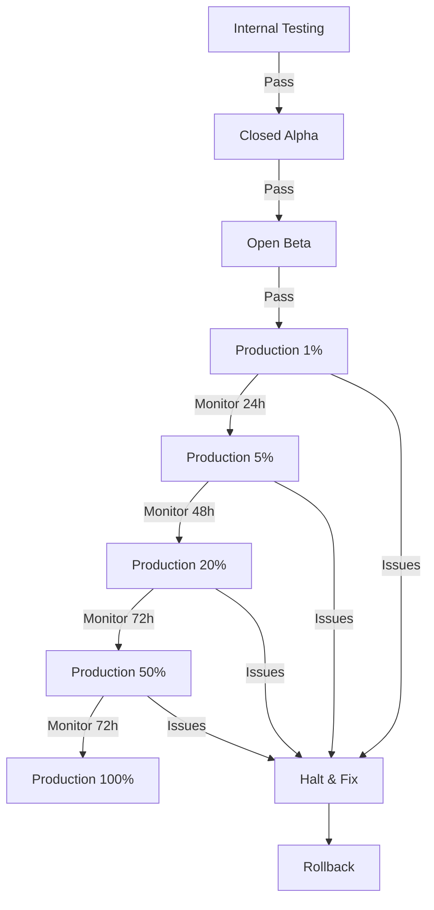

# FibreField Technician Deployment Guide

## 🚀 Deployment Overview

This guide provides comprehensive instructions for deploying the FibreField Technician Android application to production environments, including CI/CD pipeline setup, build configuration, signing procedures, and release management.

### 🎯 Deployment Targets

| Environment | Purpose | Update Frequency | Audience |
|-------------|---------|------------------|----------|
| **Development** | Feature development and testing | Continuous | Developers |
| **Staging** | Pre-production validation | Daily | QA Team, Stakeholders |
| **Production** | Live application for technicians | Weekly/On-demand | End Users |

### 📋 Prerequisites

- **Android Studio**: Arctic Fox 2020.3.1+
- **JDK**: Java 17 or higher
- **Google Play Console**: Developer account access
- **Firebase**: Project configuration
- **Signing Keys**: Production keystore files
- **CI/CD Platform**: GitHub Actions or equivalent

## 🏗️ Build Configuration

### Environment-Specific Build Variants

```kotlin
// app/build.gradle.kts
android {
    buildTypes {
        debug {
            applicationIdSuffix = ".debug"
            isDebuggable = true
            isMinifyEnabled = false
            buildConfigField("String", "API_BASE_URL", "\"https://dev-api.fibreflow.com/v1/\"")
            buildConfigField("String", "ENVIRONMENT", "\"development\"")
            resValue("string", "app_name", "FibreField Debug")
        }
        
        staging {
            initWith(getByName("debug"))
            applicationIdSuffix = ".staging"
            isDebuggable = true
            isMinifyEnabled = true
            buildConfigField("String", "API_BASE_URL", "\"https://staging-api.fibreflow.com/v1/\"")
            buildConfigField("String", "ENVIRONMENT", "\"staging\"")
            resValue("string", "app_name", "FibreField Staging")
            signingConfig = signingConfigs.getByName("staging")
        }
        
        release {
            isDebuggable = false
            isMinifyEnabled = true
            isShrinkResources = true
            buildConfigField("String", "API_BASE_URL", "\"https://api.fibreflow.com/v1/\"")
            buildConfigField("String", "ENVIRONMENT", "\"production\"")
            resValue("string", "app_name", "FibreField")
            
            proguardFiles(
                getDefaultProguardFile("proguard-android-optimize.txt"),
                "proguard-rules.pro"
            )
            
            signingConfig = signingConfigs.getByName("release")
        }
    }
    
    // Product flavors for different markets/clients
    flavorDimensions.add("market")
    productFlavors {
        create("southAfrica") {
            dimension = "market"
            buildConfigField("String", "MARKET", "\"ZA\"")
            buildConfigField("String", "DEFAULT_LANGUAGE", "\"en\"")
        }
        
        create("global") {
            dimension = "market"
            buildConfigField("String", "MARKET", "\"GLOBAL\"")
            buildConfigField("String", "DEFAULT_LANGUAGE", "\"en\"")
        }
    }
}
```

### ProGuard Configuration

```proguard
# app/proguard-rules.pro

# Keep model classes for Room and networking
-keep class com.fibreflow.technician.data.** { *; }
-keep class com.fibreflow.technician.domain.** { *; }

# Keep AI/ML model classes
-keep class com.fibreflow.technician.ai.** { *; }
-keep class ai.mlc.** { *; }

# TensorFlow Lite
-keep class org.tensorflow.lite.** { *; }

# OkHttp and Retrofit
-dontwarn okhttp3.**
-dontwarn retrofit2.**
-keep class retrofit2.** { *; }

# Room database
-keep class androidx.room.** { *; }
-keep @androidx.room.Entity class *
-keep @androidx.room.Dao class * { *; }

# Hilt
-keep class dagger.hilt.** { *; }
-keep class javax.inject.** { *; }

# Firebase
-keep class com.google.firebase.** { *; }
-keep class com.google.android.gms.** { *; }

# Biometric authentication
-keep class androidx.biometric.** { *; }

# Custom rules for reflection-based libraries
-keepclassmembers class ** {
    @com.google.gson.annotations.SerializedName <fields>;
}

# Keep line numbers for crash reporting
-keepattributes LineNumberTable,SourceFile
-renamesourcefileattribute SourceFile
```

## 🔐 App Signing Configuration

### Keystore Management

```kotlin
// app/build.gradle.kts
android {
    signingConfigs {
        create("staging") {
            storeFile = file("../keystores/staging.keystore")
            storePassword = System.getenv("STAGING_KEYSTORE_PASSWORD")
            keyAlias = "staging"
            keyPassword = System.getenv("STAGING_KEY_PASSWORD")
        }
        
        create("release") {
            storeFile = file("../keystores/release.keystore")
            storePassword = System.getenv("RELEASE_KEYSTORE_PASSWORD")
            keyAlias = "release"
            keyPassword = System.getenv("RELEASE_KEY_PASSWORD")
        }
    }
}
```

### Secure Keystore Storage

```bash
# Environment variables for CI/CD
export STAGING_KEYSTORE_PASSWORD="your_staging_password"
export STAGING_KEY_PASSWORD="your_staging_key_password"
export RELEASE_KEYSTORE_PASSWORD="your_release_password"
export RELEASE_KEY_PASSWORD="your_release_key_password"

# Store keystore files securely
# - Use encrypted storage for keystores
# - Never commit keystores to version control
# - Use separate keystores for each environment
```

### Play App Signing

For production deployments, enable **Play App Signing** in Google Play Console:

1. Upload your app signing key to Google Play Console
2. Google manages the final signing with their infrastructure key
3. Your upload key is used only for verification
4. Enhanced security and key management

## 🔄 CI/CD Pipeline

### GitHub Actions Workflow

```yaml
# .github/workflows/deploy.yml
name: Build and Deploy

on:
  push:
    branches: [ main, develop, release/* ]
  pull_request:
    branches: [ main ]

env:
  JAVA_VERSION: '17'
  
jobs:
  test:
    runs-on: ubuntu-latest
    steps:
      - uses: actions/checkout@v4
      
      - name: Set up JDK
        uses: actions/setup-java@v4
        with:
          java-version: ${{ env.JAVA_VERSION }}
          distribution: 'temurin'
          
      - name: Cache Gradle dependencies
        uses: actions/cache@v4
        with:
          path: |
            ~/.gradle/caches
            ~/.gradle/wrapper
          key: ${{ runner.os }}-gradle-${{ hashFiles('**/*.gradle*') }}
          
      - name: Run unit tests
        run: ./gradlew testDebugUnitTest
        
      - name: Run lint checks
        run: ./gradlew lintDebug
        
      - name: Generate test reports
        uses: dorny/test-reporter@v1
        if: always()
        with:
          name: Unit Test Results
          path: '**/build/test-results/test*/*.xml'
          reporter: java-junit
          
  build-debug:
    needs: test
    runs-on: ubuntu-latest
    if: github.ref == 'refs/heads/develop'
    
    steps:
      - uses: actions/checkout@v4
      
      - name: Set up JDK
        uses: actions/setup-java@v4
        with:
          java-version: ${{ env.JAVA_VERSION }}
          distribution: 'temurin'
          
      - name: Build debug APK
        run: ./gradlew assembleSouthAfricaDebug
        
      - name: Upload debug APK
        uses: actions/upload-artifact@v4
        with:
          name: debug-apk
          path: app/build/outputs/apk/southAfrica/debug/*.apk
          
  build-staging:
    needs: test
    runs-on: ubuntu-latest
    if: contains(github.ref, 'release/')
    
    steps:
      - uses: actions/checkout@v4
      
      - name: Set up JDK
        uses: actions/setup-java@v4
        with:
          java-version: ${{ env.JAVA_VERSION }}
          distribution: 'temurin'
          
      - name: Decode staging keystore
        run: echo "${{ secrets.STAGING_KEYSTORE_BASE64 }}" | base64 --decode > keystores/staging.keystore
        
      - name: Build staging APK
        env:
          STAGING_KEYSTORE_PASSWORD: ${{ secrets.STAGING_KEYSTORE_PASSWORD }}
          STAGING_KEY_PASSWORD: ${{ secrets.STAGING_KEY_PASSWORD }}
        run: ./gradlew assembleSouthAfricaStaging
        
      - name: Upload staging APK
        uses: actions/upload-artifact@v4
        with:
          name: staging-apk
          path: app/build/outputs/apk/southAfrica/staging/*.apk
          
  build-release:
    needs: test
    runs-on: ubuntu-latest
    if: github.ref == 'refs/heads/main'
    
    steps:
      - uses: actions/checkout@v4
      
      - name: Set up JDK
        uses: actions/setup-java@v4
        with:
          java-version: ${{ env.JAVA_VERSION }}
          distribution: 'temurin'
          
      - name: Decode release keystore
        run: echo "${{ secrets.RELEASE_KEYSTORE_BASE64 }}" | base64 --decode > keystores/release.keystore
        
      - name: Build release AAB
        env:
          RELEASE_KEYSTORE_PASSWORD: ${{ secrets.RELEASE_KEYSTORE_PASSWORD }}
          RELEASE_KEY_PASSWORD: ${{ secrets.RELEASE_KEY_PASSWORD }}
        run: ./gradlew bundleSouthAfricaRelease
        
      - name: Upload release AAB
        uses: actions/upload-artifact@v4
        with:
          name: release-aab
          path: app/build/outputs/bundle/southAfricaRelease/*.aab
          
  deploy-internal:
    needs: build-release
    runs-on: ubuntu-latest
    if: github.ref == 'refs/heads/main'
    
    steps:
      - uses: actions/checkout@v4
      
      - name: Download release AAB
        uses: actions/download-artifact@v4
        with:
          name: release-aab
          path: build/outputs/
          
      - name: Deploy to Google Play Internal Testing
        uses: r0adkll/upload-google-play@v1
        with:
          serviceAccountJsonPlainText: ${{ secrets.GOOGLE_PLAY_SERVICE_ACCOUNT }}
          packageName: com.fibreflow.technician
          releaseFiles: build/outputs/*.aab
          track: internal
          status: completed
          inAppUpdatePriority: 2
          whatsNewDirectory: metadata/android/en-US/changelogs
```

### Advanced CI/CD Features

```yaml
# Extended workflow with additional checks
  security-scan:
    runs-on: ubuntu-latest
    steps:
      - uses: actions/checkout@v4
      
      - name: Run security scan
        uses: securecodewarrior/github-action-add-sarif@v1
        with:
          sarif-file: 'security-scan-results.sarif'
          
      - name: Check for secrets
        uses: trufflesecurity/trufflehog@v3.63.2
        with:
          path: ./
          base: ${{ github.event.repository.default_branch }}
          head: HEAD
          
  performance-test:
    runs-on: ubuntu-latest
    steps:
      - uses: actions/checkout@v4
      
      - name: Run performance benchmarks
        run: ./gradlew :app:benchmarkRelease
        
      - name: Upload benchmark results
        uses: actions/upload-artifact@v4
        with:
          name: benchmark-results
          path: app/build/outputs/benchmark/
          
  accessibility-test:
    runs-on: ubuntu-latest
    steps:
      - uses: actions/checkout@v4
      
      - name: Run accessibility tests
        run: ./gradlew connectedAndroidTest -Pandroid.testInstrumentationRunnerArguments.annotation=androidx.test.filters.LargeTest
```

## 📱 Google Play Store Deployment

### Play Console Configuration

#### 1. App Information
```
App Name: FibreField Technician
Package Name: com.fibreflow.technician
Category: Business
Content Rating: Everyone
```

#### 2. Store Listing
```
Title: FibreField Technician - Fiber Installation Assistant
Short Description: AI-powered fiber optic installation guidance with photo validation
Full Description: [See store-listing.md for complete description]
```

#### 3. Release Management

```yaml
# Release tracks configuration
Tracks:
  Internal Testing: # Development team (up to 100 testers)
    - Automatic deployment from main branch
    - Immediate availability
    - No review required
    
  Closed Testing (Alpha): # Extended team (up to 2,000 testers)
    - Weekly releases
    - Feature validation
    - Performance testing
    
  Open Testing (Beta): # Public beta (unlimited)
    - Bi-weekly releases  
    - Real-world validation
    - Feedback collection
    
  Production: # Live release
    - Staged rollout: 1% → 5% → 20% → 50% → 100%
    - Manual approval required
    - Rollback capability
```

### Automated Play Store Deployment

```kotlin
// deploy-to-play.gradle.kts
plugins {
    id("com.github.triplet.play") version "3.8.4"
}

play {
    serviceAccountCredentials.set(file("../google-play-service-account.json"))
    track.set("internal") // internal, alpha, beta, production
    releaseStatus.set(com.github.triplet.gradle.play.publisher.ReleaseStatus.COMPLETED)
    
    // Staged rollout configuration
    userFraction.set(0.1) // Start with 10%
    
    // Update priority (0-5, 5 = immediate)
    updatePriority.set(2)
    
    // Release notes
    defaultToAppBundles.set(true)
    artifactDir.set(file("build/outputs/bundle/release"))
}
```

### Release Notes Management

```markdown
# metadata/android/en-US/changelogs/1000.txt
What's New in Version 1.0.0:

🤖 AI-Powered Guidance
• Real-time installation assistance with Phi-3.5 Mini LLM
• Context-aware troubleshooting and support

📸 Smart Photo Validation  
• Automatic ONT light detection and validation
• Equipment recognition with 96%+ accuracy
• Photo quality assessment and guidance

🗣️ Voice Interface
• Hands-free operation with voice commands
• Text-to-speech guidance and feedback

📱 Enhanced User Experience
• Offline-first architecture for reliable field use
• Improved installation workflow with step-by-step guidance
• Real-time sync with field management systems

🔐 Enterprise Security
• Biometric authentication support
• End-to-end data encryption
• Secure credential management

Bug fixes and performance improvements.
```

## 🔧 Environment Configuration

### Configuration Management

```kotlin
// BuildConfig generation
android {
    buildTypes {
        all {
            buildConfigField("String", "VERSION_NAME", "\"${defaultConfig.versionName}\"")
            buildConfigField("int", "VERSION_CODE", "${defaultConfig.versionCode}")
            buildConfigField("String", "GIT_SHA", "\"${getGitSha()}\"")
            buildConfigField("String", "BUILD_TIME", "\"${getBuildTime()}\"")
        }
    }
}

fun getGitSha(): String {
    return providers.exec {
        commandLine("git", "rev-parse", "--short", "HEAD")
    }.standardOutput.asText.get().trim()
}

fun getBuildTime(): String {
    return java.time.Instant.now().toString()
}
```

### Environment-Specific Resources

```
src/
  debug/
    res/
      values/
        config.xml          # Debug configuration
        network_security_config.xml
  staging/
    res/
      values/
        config.xml          # Staging configuration
        network_security_config.xml
  release/
    res/
      values/
        config.xml          # Production configuration
        network_security_config.xml
```

### Feature Flags

```kotlin
// Remote configuration with Firebase
@Singleton
class FeatureFlags @Inject constructor(
    private val firebaseRemoteConfig: FirebaseRemoteConfig
) {
    
    suspend fun initialize() {
        firebaseRemoteConfig.setConfigSettingsAsync(
            remoteConfigSettings {
                minimumFetchIntervalInSeconds = if (BuildConfig.DEBUG) 0 else 3600
            }
        )
        
        firebaseRemoteConfig.setDefaultsAsync(R.xml.remote_config_defaults)
        firebaseRemoteConfig.fetchAndActivate()
    }
    
    fun isAIValidationEnabled(): Boolean {
        return firebaseRemoteConfig.getBoolean("ai_validation_enabled")
    }
    
    fun getMaxPhotoRetries(): Int {
        return firebaseRemoteConfig.getLong("max_photo_retries").toInt()
    }
    
    fun isVoiceCommandsEnabled(): Boolean {
        return firebaseRemoteConfig.getBoolean("voice_commands_enabled")
    }
}
```

## 📊 Monitoring & Analytics

### Crash Reporting Setup

```kotlin
// Application class
class FibreFieldApplication : Application() {
    
    override fun onCreate() {
        super.onCreate()
        
        // Initialize crash reporting
        if (!BuildConfig.DEBUG) {
            FirebaseCrashlytics.getInstance().apply {
                setCrashlyticsCollectionEnabled(true)
                setUserId(getCurrentTechnicianId())
                setCustomKey("app_version", BuildConfig.VERSION_NAME)
                setCustomKey("environment", BuildConfig.ENVIRONMENT)
                setCustomKey("git_sha", BuildConfig.GIT_SHA)
            }
        }
        
        // Initialize performance monitoring
        FirebasePerformance.getInstance().apply {
            isPerformanceCollectionEnabled = !BuildConfig.DEBUG
        }
        
        // Initialize analytics
        FirebaseAnalytics.getInstance(this).apply {
            setAnalyticsCollectionEnabled(!BuildConfig.DEBUG)
            setUserId(getCurrentTechnicianId())
            setUserProperty("app_version", BuildConfig.VERSION_NAME)
        }
    }
}
```

### Performance Monitoring

```kotlin
@Singleton
class PerformanceMonitor @Inject constructor(
    private val firebasePerformance: FirebasePerformance
) {
    
    fun startTrace(traceName: String): Trace {
        return firebasePerformance.newTrace(traceName).apply {
            start()
        }
    }
    
    fun recordPhotoValidationPerformance(
        processingTime: Long,
        photoType: PhotoType,
        success: Boolean
    ) {
        val trace = firebasePerformance.newTrace("photo_validation")
        trace.apply {
            putAttribute("photo_type", photoType.name)
            putAttribute("success", success.toString())
            putMetric("processing_time_ms", processingTime)
            start()
            stop()
        }
    }
    
    fun recordLLMPerformance(
        responseTime: Long,
        tokensGenerated: Int,
        success: Boolean
    ) {
        val trace = firebasePerformance.newTrace("llm_inference")
        trace.apply {
            putAttribute("success", success.toString())
            putMetric("response_time_ms", responseTime)
            putMetric("tokens_generated", tokensGenerated.toLong())
            start()
            stop()
        }
    }
}
```

## 🔄 Rollback Procedures

### Emergency Rollback Plan

```yaml
# Emergency rollback workflow
name: Emergency Rollback

on:
  workflow_dispatch:
    inputs:
      rollback_version:
        description: 'Version to rollback to'
        required: true
        type: string
      reason:
        description: 'Rollback reason'
        required: true
        type: string

jobs:
  rollback:
    runs-on: ubuntu-latest
    steps:
      - name: Rollback Play Store release
        uses: r0adkll/upload-google-play@v1
        with:
          serviceAccountJsonPlainText: ${{ secrets.GOOGLE_PLAY_SERVICE_ACCOUNT }}
          packageName: com.fibreflow.technician
          track: production
          # Rollback to previous version
          releaseStatus: halt
          
      - name: Notify team
        uses: 8398a7/action-slack@v3
        with:
          status: custom
          custom_payload: |
            {
              "text": "🚨 Emergency rollback initiated",
              "attachments": [{
                "color": "danger",
                "fields": [
                  {"title": "Version", "value": "${{ github.event.inputs.rollback_version }}", "short": true},
                  {"title": "Reason", "value": "${{ github.event.inputs.reason }}", "short": true}
                ]
              }]
            }
        env:
          SLACK_WEBHOOK_URL: ${{ secrets.SLACK_WEBHOOK }}
```

### Rollback Procedures

1. **Immediate Actions**
   - Halt current rollout in Play Console
   - Revert to previous stable version
   - Notify development and support teams

2. **Investigation**
   - Analyze crash reports and user feedback
   - Identify root cause of issues
   - Document findings and timeline

3. **Communication**
   - Update status page
   - Inform stakeholders
   - Prepare user communication

4. **Recovery Planning**
   - Plan hotfix development
   - Schedule next release
   - Implement additional safeguards

## 📋 Pre-Deployment Checklist

### Technical Validation

- [ ] **Code Quality**
  - [ ] All tests passing (unit, integration, UI)
  - [ ] Code coverage >90%
  - [ ] Lint checks passing
  - [ ] Security scan completed

- [ ] **Build Verification**
  - [ ] Release build successful
  - [ ] APK/AAB size within limits (<150MB)
  - [ ] ProGuard/R8 optimization working
  - [ ] All dependencies up to date

- [ ] **Functionality Testing**
  - [ ] Critical user flows working
  - [ ] AI models loading and functioning
  - [ ] Photo validation accuracy verified
  - [ ] Offline functionality tested

- [ ] **Performance Testing**
  - [ ] App startup time <3s
  - [ ] Memory usage optimized
  - [ ] Battery impact minimal
  - [ ] Network usage efficient

- [ ] **Security Review**
  - [ ] API endpoints secured
  - [ ] Data encryption verified
  - [ ] Biometric authentication working
  - [ ] Permissions properly configured

### Business Validation

- [ ] **Stakeholder Approval**
  - [ ] Product manager sign-off
  - [ ] QA team approval
  - [ ] Technical lead review

- [ ] **Release Planning**
  - [ ] Release notes prepared
  - [ ] Support documentation updated
  - [ ] Training materials ready
  - [ ] Rollback plan verified

- [ ] **Monitoring Setup**
  - [ ] Analytics configured
  - [ ] Crash reporting active
  - [ ] Performance monitoring enabled
  - [ ] Alert thresholds set

## 🎯 Release Strategy

### Staged Rollout



### Release Criteria

| Stage | Success Criteria | Monitoring Period | Rollback Triggers |
|-------|-----------------|-------------------|-------------------|
| **1%** | Crash rate <0.1%, No critical bugs | 24 hours | Crash rate >0.5% |
| **5%** | User satisfaction >4.0, Performance stable | 48 hours | Crashes >1%, Performance degradation |
| **20%** | Feature adoption >80%, Support tickets <10 | 72 hours | Critical functionality broken |
| **50%** | Overall metrics stable, Positive feedback | 72 hours | User satisfaction <3.5 |
| **100%** | All KPIs green, No blocking issues | Ongoing | Any critical production issue |

### Release Communication

```markdown
# Release Communication Template

## Pre-Release (1 week before)
- [ ] Announce upcoming release to stakeholders
- [ ] Schedule release communications
- [ ] Prepare support team with new features
- [ ] Update documentation and help content

## Release Day
- [ ] Monitor rollout metrics in real-time
- [ ] Have development team on standby
- [ ] Send release announcement to users
- [ ] Update status page

## Post-Release (48 hours after)
- [ ] Analyze user feedback and metrics  
- [ ] Document lessons learned
- [ ] Plan next release improvements
- [ ] Conduct retrospective meeting
```

## 🔍 Troubleshooting

### Common Deployment Issues

| Issue | Symptoms | Solution |
|-------|----------|----------|
| **Build Failure** | Gradle build errors | Check dependencies, clean build, verify keystore |
| **Signing Issues** | APK not signed properly | Verify keystore path and credentials |
| **Play Store Rejection** | Upload failed | Check package name, version codes, permissions |
| **Performance Regression** | App slower than expected | Profile release build, check ProGuard rules |
| **Crash on Launch** | App crashes immediately | Check manifest, verify all resources included |

### Debug Commands

```bash
# Build diagnostics
./gradlew assembleRelease --stacktrace --info

# APK analysis
bundletool build-apks --bundle=app.aab --output=app.apks
bundletool install-apks --apks=app.apks

# Performance profiling  
./gradlew :app:benchmarkRelease
adb shell dumpsys meminfo com.fibreflow.technician

# Network debugging
adb shell setprop debug.fibreflow.network true
adb logcat | grep -i network
```

---

## 📞 Support Contacts

### Deployment Support Team

| Role | Contact | Responsibility |
|------|---------|----------------|
| **DevOps Lead** | devops@fibreflow.com | CI/CD pipeline, infrastructure |
| **Release Manager** | releases@fibreflow.com | Release coordination, rollouts |  
| **QA Lead** | qa@fibreflow.com | Testing, quality gates |
| **Security Officer** | security@fibreflow.com | Security reviews, compliance |
| **Play Console Admin** | playstore@fibreflow.com | Google Play management |

### Emergency Contacts

- **24/7 Hotline**: +27 21 XXX XXXX
- **Slack Channel**: #fibrefield-emergency
- **Email**: emergency@fibreflow.com

---

## 📚 Additional Resources

- [Google Play Console Help](https://support.google.com/googleplay/android-developer)
- [Android App Bundle Guide](https://developer.android.com/guide/app-bundle)
- [Firebase App Distribution](https://firebase.google.com/docs/app-distribution)
- [GitHub Actions for Android](https://docs.github.com/en/actions/guides/building-and-testing-java-with-gradle)

---

**Deployment Guide Version**: 1.0  
**Last Updated**: March 2024  
**Next Review**: June 2024