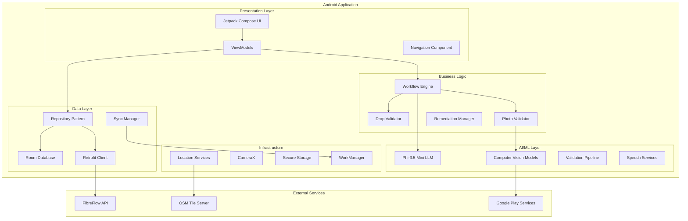

# FibreField Technician BOT - Technical Architecture Document

## System Architecture Overview



## Module Architecture

### 1. App Module Structure

```
app/
├── src/main/java/com/fibreflow/technician/
│   ├── FibreFieldApplication.kt
│   ├── MainActivity.kt
│   └── navigation/
│       └── AppNavigation.kt
├── build.gradle.kts
└── proguard-rules.pro

feature/
├── authentication/
│   ├── data/
│   ├── domain/
│   └── presentation/
├── installation/
│   ├── data/
│   ├── domain/
│   └── presentation/
├── drops/
│   ├── data/
│   ├── domain/
│   └── presentation/
├── activation/
│   ├── data/
│   ├── domain/
│   └── presentation/
└── remediation/
    ├── data/
    ├── domain/
    └── presentation/

core/
├── database/
│   ├── entities/
│   ├── dao/
│   ├── converters/
│   └── FibreFieldDatabase.kt
├── network/
│   ├── api/
│   ├── interceptors/
│   └── NetworkModule.kt
├── ai/
│   ├── llm/
│   ├── vision/
│   └── speech/
├── common/
│   ├── utils/
│   ├── extensions/
│   └── constants/
└── design/
    ├── theme/
    ├── components/
    └── animations/
```

### 2. Dependency Injection Architecture

```kotlin
// Hilt Modules Structure

@Module
@InstallIn(SingletonComponent::class)
object DatabaseModule {
    @Provides
    @Singleton
    fun provideDatabase(@ApplicationContext context: Context): FibreFieldDatabase {
        return Room.databaseBuilder(
            context,
            FibreFieldDatabase::class.java,
            "fibrefield.db"
        )
        .addMigrations(*ALL_MIGRATIONS)
        .fallbackToDestructiveMigration()
        .build()
    }
    
    @Provides
    fun provideDropDao(database: FibreFieldDatabase) = database.dropDao()
    
    @Provides
    fun provideInstallationDao(database: FibreFieldDatabase) = database.installationDao()
}

@Module
@InstallIn(SingletonComponent::class)
object NetworkModule {
    @Provides
    @Singleton
    fun provideOkHttpClient(
        authInterceptor: AuthInterceptor,
        loggingInterceptor: HttpLoggingInterceptor
    ): OkHttpClient {
        return OkHttpClient.Builder()
            .addInterceptor(authInterceptor)
            .addInterceptor(loggingInterceptor)
            .connectTimeout(30, TimeUnit.SECONDS)
            .readTimeout(30, TimeUnit.SECONDS)
            .build()
    }
    
    @Provides
    @Singleton
    fun provideRetrofit(okHttpClient: OkHttpClient): Retrofit {
        return Retrofit.Builder()
            .baseUrl(BuildConfig.API_BASE_URL)
            .client(okHttpClient)
            .addConverterFactory(GsonConverterFactory.create())
            .build()
    }
}

@Module
@InstallIn(SingletonComponent::class)
object AIModule {
    @Provides
    @Singleton
    fun provideLLMEngine(@ApplicationContext context: Context): LLMEngine {
        return Phi35MiniEngine(
            context = context,
            modelPath = "models/phi-3.5-mini-q4.gguf",
            config = LLMConfig(
                maxTokens = 250,
                temperature = 0.3f,
                contextWindow = 8192
            )
        )
    }
    
    @Provides
    @Singleton
    fun provideVisionPipeline(
        @ApplicationContext context: Context
    ): VisionValidationPipeline {
        return VisionValidationPipeline(
            mlKit = MLKitVisionAPI(context),
            ontDetector = ONTLightDetector(context),
            equipmentDetector = YOLOv8Detector(context),
            qualityAnalyzer = PhotoQualityAnalyzer()
        )
    }
}
```

## AI/ML Architecture Details

### 1. LLM Integration Architecture

```kotlin
// LLM Engine Implementation
class Phi35MiniEngine(
    private val context: Context,
    private val modelPath: String,
    private val config: LLMConfig
) : LLMEngine {
    
    private var model: MLCModel? = null
    private val contextManager = ConversationContextManager(config.contextWindow)
    
    override suspend fun initialize(): Result<Unit> = withContext(Dispatchers.IO) {
        try {
            // Load model using MLC LLM
            model = MLCModel.load(
                context.assets.open(modelPath),
                MLCConfig.builder()
                    .setNumThreads(4)
                    .setUseGPU(true)
                    .build()
            )
            Result.success(Unit)
        } catch (e: Exception) {
            Result.failure(e)
        }
    }
    
    override suspend fun generateResponse(
        prompt: String,
        systemPrompt: String? = null
    ): Result<String> = withContext(Dispatchers.Default) {
        try {
            val fullPrompt = buildPrompt(systemPrompt, prompt)
            val tokens = model?.tokenize(fullPrompt) ?: return Result.failure(
                IllegalStateException("Model not initialized")
            )
            
            val response = model?.generate(
                tokens,
                maxNewTokens = config.maxTokens,
                temperature = config.temperature,
                topP = 0.9f
            )
            
            contextManager.addTurn(prompt, response ?: "")
            Result.success(response ?: "")
        } catch (e: Exception) {
            Result.failure(e)
        }
    }
    
    private fun buildPrompt(systemPrompt: String?, userPrompt: String): String {
        return """
            <|system|>
            ${systemPrompt ?: "You are a helpful fiber installation assistant."}
            <|end|>
            <|user|>
            $userPrompt
            <|end|>
            <|assistant|>
        """.trimIndent()
    }
}

// Conversation Context Manager
class ConversationContextManager(private val maxTokens: Int) {
    private val conversationHistory = mutableListOf<ConversationTurn>()
    private var currentTokenCount = 0
    
    fun addTurn(userInput: String, assistantResponse: String) {
        val turn = ConversationTurn(userInput, assistantResponse)
        val turnTokens = estimateTokens(turn)
        
        // Manage context window
        while (currentTokenCount + turnTokens > maxTokens && conversationHistory.isNotEmpty()) {
            val removed = conversationHistory.removeFirst()
            currentTokenCount -= estimateTokens(removed)
        }
        
        conversationHistory.add(turn)
        currentTokenCount += turnTokens
    }
    
    fun getContext(): String {
        return conversationHistory.joinToString("\n") { turn ->
            "User: ${turn.userInput}\nAssistant: ${turn.assistantResponse}"
        }
    }
}
```

### 2. Computer Vision Pipeline Architecture

```kotlin
// Vision Validation Pipeline
class VisionValidationPipeline(
    private val mlKit: MLKitVisionAPI,
    private val ontDetector: ONTLightDetector,
    private val equipmentDetector: YOLOv8Detector,
    private val qualityAnalyzer: PhotoQualityAnalyzer
) {
    
    suspend fun validatePhoto(
        bitmap: Bitmap,
        photoType: PhotoType,
        metadata: PhotoMetadata
    ): ValidationResult = coroutineScope {
        
        // Parallel quality checks
        val qualityDeferred = async { qualityAnalyzer.analyze(bitmap) }
        val ocrDeferred = async { mlKit.extractText(bitmap) }
        
        // Type-specific validation
        when (photoType) {
            PhotoType.ONT_ACTIVE -> validateONTPhoto(bitmap, metadata, qualityDeferred.await(), ocrDeferred.await())
            PhotoType.BARCODE -> validateBarcode(bitmap)
            PhotoType.CABLE_SPAN -> validateCableSpan(bitmap, qualityDeferred.await())
            // ... other types
        }
    }
    
    private suspend fun validateONTPhoto(
        bitmap: Bitmap,
        metadata: PhotoMetadata,
        quality: QualityResult,
        ocrText: List<String>
    ): ValidationResult {
        
        // Run ONT-specific detection
        val lightDetection = ontDetector.detect(bitmap)
        val equipmentDetection = equipmentDetector.detect(bitmap)
        
        // Validation logic
        val issues = mutableListOf<ValidationIssue>()
        
        if (lightDetection.powerLight != LightState.ON) {
            issues.add(ValidationIssue.POWER_LIGHT_OFF)
        }
        if (lightDetection.losLight != LightState.ON) {
            issues.add(ValidationIssue.LOS_LIGHT_OFF)
        }
        if (lightDetection.ponLight != LightState.ON) {
            issues.add(ValidationIssue.PON_LIGHT_OFF)
        }
        if (lightDetection.lanLight != LightState.ON) {
            issues.add(ValidationIssue.LAN_LIGHT_OFF)
        }
        
        val dropNumberVisible = ocrText.any { 
            it.contains(metadata.dropNumber, ignoreCase = true) 
        }
        
        if (!dropNumberVisible) {
            issues.add(ValidationIssue.DROP_NUMBER_NOT_VISIBLE)
        }
        
        return if (issues.isEmpty()) {
            ValidationResult.Success(
                confidence = lightDetection.confidence,
                metadata = mapOf(
                    "lights_detected" to 4,
                    "drop_verified" to true
                )
            )
        } else {
            ValidationResult.Failed(
                issues = issues,
                allowOverride = true,
                confidence = lightDetection.confidence
            )
        }
    }
}

// Custom ONT Light Detector
class ONTLightDetector(private val context: Context) {
    
    private lateinit var interpreter: Interpreter
    
    suspend fun initialize() = withContext(Dispatchers.IO) {
        val modelFile = loadModelFile("ont_light_detector.tflite")
        interpreter = Interpreter(modelFile)
    }
    
    suspend fun detect(bitmap: Bitmap): ONTLightDetection = withContext(Dispatchers.Default) {
        // Preprocess image
        val input = preprocessBitmap(bitmap)
        
        // Run inference
        val output = Array(1) { FloatArray(8) } // 4 lights × 2 states (on/off)
        interpreter.run(input, output)
        
        // Parse results
        ONTLightDetection(
            powerLight = if (output[0][0] > output[0][1]) LightState.ON else LightState.OFF,
            losLight = if (output[0][2] > output[0][3]) LightState.ON else LightState.OFF,
            ponLight = if (output[0][4] > output[0][5]) LightState.ON else LightState.OFF,
            lanLight = if (output[0][6] > output[0][7]) LightState.ON else LightState.OFF,
            confidence = output[0].max()
        )
    }
    
    private fun preprocessBitmap(bitmap: Bitmap): ByteBuffer {
        val resized = Bitmap.createScaledBitmap(bitmap, 224, 224, true)
        val buffer = ByteBuffer.allocateDirect(224 * 224 * 3 * 4)
        buffer.order(ByteOrder.nativeOrder())
        
        val pixels = IntArray(224 * 224)
        resized.getPixels(pixels, 0, 224, 0, 0, 224, 224)
        
        for (pixel in pixels) {
            buffer.putFloat(((pixel shr 16 and 0xFF) - 127.5f) / 127.5f)
            buffer.putFloat(((pixel shr 8 and 0xFF) - 127.5f) / 127.5f)
            buffer.putFloat(((pixel and 0xFF) - 127.5f) / 127.5f)
        }
        
        return buffer
    }
}
```

## Data Flow Architecture

### 1. Installation Workflow State Machine

```kotlin
// Workflow State Management
sealed class InstallationState {
    object Idle : InstallationState()
    data class ProjectSelected(val project: Project) : InstallationState()
    data class DropValidated(val drop: Drop) : InstallationState()
    data class PhotoCapture(val step: Int, val totalSteps: Int) : InstallationState()
    data class PhotoValidation(val photo: Photo, val result: ValidationResult) : InstallationState()
    object ReviewPhotos : InstallationState()
    object Submitting : InstallationState()
    object Completed : InstallationState()
    data class Error(val error: AppError) : InstallationState()
}

class InstallationWorkflowEngine(
    private val dropRepository: DropRepository,
    private val installationRepository: InstallationRepository,
    private val photoValidator: PhotoValidator,
    private val llmEngine: LLMEngine
) {
    
    private val _state = MutableStateFlow<InstallationState>(InstallationState.Idle)
    val state: StateFlow<InstallationState> = _state.asStateFlow()
    
    private var currentInstallation: Installation? = null
    private val photos = mutableListOf<Photo>()
    
    suspend fun startInstallation(dropNumber: String) {
        try {
            // Validate drop
            val drop = dropRepository.validateDrop(dropNumber)
            _state.value = InstallationState.DropValidated(drop)
            
            // Create installation record
            currentInstallation = installationRepository.createInstallation(drop)
            
            // Start photo capture
            _state.value = InstallationState.PhotoCapture(1, 9)
            
            // LLM guidance
            llmEngine.speak("Great! Let's start documenting the installation. First, capture the cable span from pole to house.")
            
        } catch (e: Exception) {
            _state.value = InstallationState.Error(AppError.from(e))
        }
    }
    
    suspend fun capturePhoto(bitmap: Bitmap, photoType: PhotoType) {
        val currentStep = (state.value as? InstallationState.PhotoCapture)?.step ?: return
        
        // Validate photo
        val validationResult = photoValidator.validate(bitmap, photoType)
        _state.value = InstallationState.PhotoValidation(
            Photo(bitmap, photoType),
            validationResult
        )
        
        when (validationResult) {
            is ValidationResult.Success -> {
                photos.add(Photo(bitmap, photoType, validationResult))
                llmEngine.speak(getSuccessMessage(photoType))
                proceedToNextStep(currentStep)
            }
            is ValidationResult.Failed -> {
                llmEngine.speak(getRetryMessage(validationResult.issues))
                // Allow retry or manual override
            }
        }
    }
    
    private suspend fun proceedToNextStep(currentStep: Int) {
        if (currentStep < 9) {
            _state.value = InstallationState.PhotoCapture(currentStep + 1, 9)
            llmEngine.speak(getStepGuidance(currentStep + 1))
        } else {
            _state.value = InstallationState.ReviewPhotos
            llmEngine.speak("All photos captured! Please review before submitting.")
        }
    }
}
```

### 2. Offline Sync Architecture

```kotlin
// Sync Manager Implementation
@Singleton
class SyncManager @Inject constructor(
    private val workManager: WorkManager,
    private val syncRepository: SyncRepository,
    private val connectivityManager: ConnectivityManager
) {
    
    fun scheduleSyncWork() {
        val constraints = Constraints.Builder()
            .setRequiredNetworkType(NetworkType.CONNECTED)
            .build()
        
        val syncWork = PeriodicWorkRequestBuilder<SyncWorker>(15, TimeUnit.MINUTES)
            .setConstraints(constraints)
            .setBackoffCriteria(
                BackoffPolicy.EXPONENTIAL,
                WorkRequest.MIN_BACKOFF_MILLIS,
                TimeUnit.MILLISECONDS
            )
            .build()
        
        workManager.enqueueUniquePeriodicWork(
            "sync_work",
            ExistingPeriodicWorkPolicy.KEEP,
            syncWork
        )
    }
    
    suspend fun performSync(): SyncResult {
        return try {
            // Get pending items
            val pendingInstallations = syncRepository.getPendingInstallations()
            val pendingPhotos = syncRepository.getPendingPhotos()
            
            // Batch upload
            val syncRequest = SyncBatchRequest(
                installations = pendingInstallations,
                photos = pendingPhotos,
                deviceId = getDeviceId(),
                timestamp = System.currentTimeMillis()
            )
            
            val response = syncRepository.syncBatch(syncRequest)
            
            // Handle conflicts
            response.conflicts.forEach { conflict ->
                resolveConflict(conflict)
            }
            
            // Update local database
            markSyncedItems(response.synced)
            
            SyncResult.Success(
                synced = response.synced.installations + response.synced.photos,
                failed = response.failed.size,
                conflicts = response.conflicts.size
            )
            
        } catch (e: Exception) {
            SyncResult.Failed(e)
        }
    }
    
    private suspend fun resolveConflict(conflict: SyncConflict) {
        when (conflict.type) {
            ConflictType.DROP_STATUS -> {
                // Server wins for status conflicts
                syncRepository.updateDropStatus(
                    conflict.dropNumber,
                    conflict.serverStatus
                )
            }
            ConflictType.DUPLICATE_PHOTO -> {
                // Keep local photo, mark as duplicate
                syncRepository.markPhotoDuplicate(conflict.photoId)
            }
        }
    }
}

// Sync Worker
class SyncWorker @AssistedInject constructor(
    @Assisted context: Context,
    @Assisted params: WorkerParameters,
    private val syncManager: SyncManager
) : CoroutineWorker(context, params) {
    
    override suspend fun doWork(): Result {
        return when (val syncResult = syncManager.performSync()) {
            is SyncResult.Success -> {
                if (syncResult.failed > 0) {
                    Result.retry()
                } else {
                    Result.success()
                }
            }
            is SyncResult.Failed -> {
                if (runAttemptCount < 3) {
                    Result.retry()
                } else {
                    Result.failure()
                }
            }
        }
    }
}
```

## Performance Optimization Strategies

### 1. Memory Management

```kotlin
// Model Memory Manager
class ModelMemoryManager(
    private val context: Context,
    private val memoryThreshold: Long = 500_000_000L // 500MB
) {
    
    private val loadedModels = mutableMapOf<ModelType, Any>()
    private val modelSizes = mapOf(
        ModelType.LLM to 2_000_000_000L, // 2GB
        ModelType.ONT_DETECTOR to 30_000_000L, // 30MB
        ModelType.YOLO to 20_000_000L, // 20MB
        ModelType.QUALITY to 15_000_000L // 15MB
    )
    
    suspend fun loadModel(type: ModelType): Any? {
        // Check available memory
        val availableMemory = getAvailableMemory()
        val requiredMemory = modelSizes[type] ?: 0L
        
        if (availableMemory < requiredMemory + memoryThreshold) {
            // Unload least recently used models
            unloadLRUModels(requiredMemory)
        }
        
        return when (type) {
            ModelType.LLM -> loadLLM()
            ModelType.ONT_DETECTOR -> loadONTDetector()
            ModelType.YOLO -> loadYOLO()
            ModelType.QUALITY -> loadQualityAnalyzer()
        }?.also {
            loadedModels[type] = it
        }
    }
    
    private fun getAvailableMemory(): Long {
        val runtime = Runtime.getRuntime()
        return runtime.maxMemory() - (runtime.totalMemory() - runtime.freeMemory())
    }
    
    private suspend fun unloadLRUModels(requiredMemory: Long) {
        var freedMemory = 0L
        val sortedModels = loadedModels.entries.sortedBy { it.value.hashCode() }
        
        for ((type, model) in sortedModels) {
            if (type == ModelType.LLM) continue // Never unload LLM
            
            unloadModel(type)
            freedMemory += modelSizes[type] ?: 0L
            
            if (freedMemory >= requiredMemory) break
        }
    }
}
```

### 2. Battery Optimization

```kotlin
// Power-Aware AI Manager
class PowerAwareAIManager(
    private val context: Context,
    private val batteryManager: BatteryManager
) {
    
    enum class PowerMode {
        HIGH_PERFORMANCE, // Full AI features
        BALANCED, // Reduced inference frequency
        POWER_SAVING // Minimal AI, manual mode
    }
    
    private var currentMode = PowerMode.BALANCED
    
    fun adjustPowerMode() {
        val batteryLevel = batteryManager.getIntProperty(BatteryManager.BATTERY_PROPERTY_CAPACITY)
        val isCharging = batteryManager.isCharging()
        
        currentMode = when {
            isCharging -> PowerMode.HIGH_PERFORMANCE
            batteryLevel > 50 -> PowerMode.BALANCED
            else -> PowerMode.POWER_SAVING
        }
        
        applyPowerMode()
    }
    
    private fun applyPowerMode() {
        when (currentMode) {
            PowerMode.HIGH_PERFORMANCE -> {
                // Full AI features
                setInferenceThreads(4)
                enableGPU(true)
                setValidationMode(ValidationMode.FULL)
            }
            PowerMode.BALANCED -> {
                // Reduced performance
                setInferenceThreads(2)
                enableGPU(false)
                setValidationMode(ValidationMode.ESSENTIAL)
            }
            PowerMode.POWER_SAVING -> {
                // Minimal AI
                setInferenceThreads(1)
                enableGPU(false)
                setValidationMode(ValidationMode.MANUAL)
            }
        }
    }
}
```

## Security Architecture

### 1. Data Encryption

```kotlin
// Secure Storage Implementation
class SecureStorageManager(private val context: Context) {
    
    private val masterKey = MasterKey.Builder(context)
        .setKeyScheme(MasterKey.KeyScheme.AES256_GCM)
        .build()
    
    private val encryptedPrefs = EncryptedSharedPreferences.create(
        context,
        "secure_prefs",
        masterKey,
        EncryptedSharedPreferences.PrefKeyEncryptionScheme.AES256_SIV,
        EncryptedSharedPreferences.PrefValueEncryptionScheme.AES256_GCM
    )
    
    fun saveCredentials(credentials: Credentials) {
        encryptedPrefs.edit {
            putString("username", credentials.username)
            putString("password", credentials.password)
            putString("token", credentials.token)
            putLong("token_expiry", credentials.tokenExpiry)
        }
    }
    
    fun getCredentials(): Credentials? {
        return try {
            Credentials(
                username = encryptedPrefs.getString("username", null) ?: return null,
                password = encryptedPrefs.getString("password", null) ?: return null,
                token = encryptedPrefs.getString("token", null),
                tokenExpiry = encryptedPrefs.getLong("token_expiry", 0L)
            )
        } catch (e: Exception) {
            null
        }
    }
}

// Database Encryption with SQLCipher
@Database(
    entities = [
        Drop::class,
        Installation::class,
        Photo::class,
        // ... other entities
    ],
    version = 1,
    exportSchema = true
)
@TypeConverters(DatabaseConverters::class)
abstract class FibreFieldDatabase : RoomDatabase() {
    
    companion object {
        fun create(context: Context): FibreFieldDatabase {
            val passphrase = SQLCipherUtils.getPassphrase(context)
            val factory = SupportFactory(passphrase)
            
            return Room.databaseBuilder(
                context,
                FibreFieldDatabase::class.java,
                "fibrefield.db"
            )
            .openHelperFactory(factory)
            .build()
        }
    }
}
```

### 2. Network Security

```kotlin
// Certificate Pinning Implementation
class CertificatePinningInterceptor : Interceptor {
    
    private val certificatePinner = CertificatePinner.Builder()
        .add(
            "api.fibreflow.com",
            "sha256/AAAAAAAAAAAAAAAAAAAAAAAAAAAAAAAAAAAAAAAAAAA="
        )
        .build()
    
    override fun intercept(chain: Interceptor.Chain): Response {
        val request = chain.request()
        
        // Verify certificate
        certificatePinner.check(request.url.host, chain.connection()?.handshake()?.peerCertificates)
        
        // Add request signing
        val signedRequest = signRequest(request)
        
        return chain.proceed(signedRequest)
    }
    
    private fun signRequest(request: Request): Request {
        val timestamp = System.currentTimeMillis().toString()
        val nonce = UUID.randomUUID().toString()
        val signature = generateSignature(request, timestamp, nonce)
        
        return request.newBuilder()
            .header("X-Timestamp", timestamp)
            .header("X-Nonce", nonce)
            .header("X-Signature", signature)
            .build()
    }
}
```

## Testing Architecture

### 1. Test Structure

```kotlin
// Unit Test Example
class PhotoValidatorTest {
    
    @get:Rule
    val instantTaskExecutorRule = InstantTaskExecutorRule()
    
    private lateinit var photoValidator: PhotoValidator
    private val mockVisionPipeline = mockk<VisionValidationPipeline>()
    private val mockLLMEngine = mockk<LLMEngine>()
    
    @Before
    fun setup() {
        photoValidator = PhotoValidator(mockVisionPipeline, mockLLMEngine)
    }
    
    @Test
    fun `validate ONT photo with all lights on returns success`() = runTest {
        // Given
        val bitmap = createTestBitmap()
        val detection = ONTLightDetection(
            powerLight = LightState.ON,
            losLight = LightState.ON,
            ponLight = LightState.ON,
            lanLight = LightState.ON,
            confidence = 0.95f
        )
        
        coEvery { mockVisionPipeline.validatePhoto(any(), any(), any()) } returns 
            ValidationResult.Success(confidence = 0.95f)
        
        // When
        val result = photoValidator.validate(bitmap, PhotoType.ONT_ACTIVE)
        
        // Then
        assertTrue(result is ValidationResult.Success)
        assertEquals(0.95f, (result as ValidationResult.Success).confidence)
    }
}

// Integration Test Example
@MediumTest
@RunWith(AndroidJUnit4::class)
class InstallationWorkflowIntegrationTest {
    
    @get:Rule
    val hiltRule = HiltAndroidRule(this)
    
    @Inject
    lateinit var workflowEngine: InstallationWorkflowEngine
    
    @Inject
    lateinit var testDatabase: FibreFieldDatabase
    
    @Before
    fun setup() {
        hiltRule.inject()
    }
    
    @Test
    fun completeInstallationWorkflow() = runTest {
        // Start installation
        workflowEngine.startInstallation("DROP001")
        
        // Capture all 9 photos
        repeat(9) { step ->
            val bitmap = loadTestPhoto(step)
            workflowEngine.capturePhoto(bitmap, getPhotoType(step))
        }
        
        // Submit installation
        workflowEngine.submitInstallation()
        
        // Verify database state
        val installation = testDatabase.installationDao().getByDropNumber("DROP001")
        assertNotNull(installation)
        assertEquals(InstallationStatus.PENDING_ACTIVATION, installation.status)
        
        val photos = testDatabase.photoDao().getByInstallationId(installation.id)
        assertEquals(9, photos.size)
    }
}
```

## Monitoring & Analytics

### 1. Performance Monitoring

```kotlin
// Performance Tracker
class PerformanceTracker(
    private val analytics: FirebaseAnalytics
) {
    
    fun trackPhotoValidation(
        photoType: PhotoType,
        processingTime: Long,
        result: ValidationResult,
        modelUsed: String
    ) {
        analytics.logEvent("photo_validation") {
            param("photo_type", photoType.name)
            param("processing_time_ms", processingTime)
            param("validation_result", result.javaClass.simpleName)
            param("model_used", modelUsed)
            param("confidence", (result as? ValidationResult.Success)?.confidence ?: 0f)
        }
    }
    
    fun trackInstallationCompletion(
        duration: Long,
        photosCount: Int,
        retakeCount: Int,
        manualOverrideCount: Int
    ) {
        analytics.logEvent("installation_completed") {
            param("duration_minutes", duration / 60000)
            param("photos_count", photosCount)
            param("retake_count", retakeCount)
            param("manual_override_count", manualOverrideCount)
            param("success_rate", (photosCount - retakeCount).toFloat() / photosCount)
        }
    }
    
    fun trackAIPerformance(
        modelType: ModelType,
        loadTime: Long,
        inferenceTime: Long,
        accuracy: Float
    ) {
        analytics.logEvent("ai_performance") {
            param("model_type", modelType.name)
            param("load_time_ms", loadTime)
            param("inference_time_ms", inferenceTime)
            param("accuracy", accuracy)
            param("memory_usage_mb", Runtime.getRuntime().totalMemory() / 1024 / 1024)
        }
    }
}
```

---

*This technical architecture document provides the detailed implementation blueprint for the FibreField Technician BOT Android application, covering all major architectural components, patterns, and implementation strategies.*